# OXS Game Design Document

**Version:** 1.0.0
**Status:** Draft
**Date:** 2026-01-16
**Author:** Friday Games Design Team
**Classification:** Internal

---

## Document Control

| Version | Date | Author | Changes |
|---------|------|--------|---------|
| 1.0.0 | 2026-01-16 | Friday Games | Initial draft |

---

## Table of Contents

1. [Game Overview](#1-game-overview)
2. [Core Mechanics](#2-core-mechanics)
3. [Game Flow](#3-game-flow)
4. [AI Design](#4-ai-design)
5. [Multiplayer Design](#5-multiplayer-design)
6. [UI/UX Design](#6-uiux-design)
7. [Audio-Visual Style](#7-audio-visual-style)
8. [Requirements Traceability Matrix](#8-requirements-traceability-matrix)
9. [Appendices](#9-appendices)

---

# 1. Game Overview

## 1.1 Concept

OXS is a modern interpretation of the classic Noughts and Crosses (Tic-Tac-Toe) game, elevated beyond its traditional form through variable board sizes, configurable win conditions, and multiple play modes. Players compete to align their symbols—X or O—on boards ranging from 3×3 to 5×5, with victory requiring anywhere from 3 to 5 symbols in a row depending on configuration. The game supports local two-player matches on a single device, challenging AI opponents with three difficulty levels plus an adaptive mode, and networked play via direct IP connection. With polished animations, strategic depth through larger boards, and match-based competitive play, OXS transforms a childhood classic into a satisfying modern experience.

*Traces to: CORE-001, CORE-002*

## 1.2 Target Audience

| User Class | Profile | Motivation |
|------------|---------|------------|
| **Casual Player** | All ages, minimal gaming experience | Quick games against AI or local friend; relaxation |
| **Competitive Player** | Teens to adults, enjoys strategy | Match play, statistics tracking, mastering larger boards |
| **Network Player** | Moderate technical skill | Playing with remote friends; social gaming |

The game prioritises accessibility for casual players whilst providing depth for those seeking strategic challenge through larger board configurations and match play.

*Traces to: Requirements §2.2 User Classes*

## 1.3 Platform Targets

| Platform | Support Level | Notes |
|----------|---------------|-------|
| Windows | Primary | Windows 10/11, x64 |
| Linux | Primary | Major distributions (Ubuntu, Fedora, Arch) |
| macOS | Primary | macOS 12+ (Monterey and later) |

**Minimum Hardware Requirements:**
- GPU: NVIDIA GTX 750 / Intel HD 620 or equivalent
- RAM: 8 GB system memory
- Display: 720p minimum, supports up to 4K
- Aspect Ratios: 4:3, 16:9, 16:10, 21:9

*Traces to: UI-001, CON-005, UI-007, UI-008*

## 1.4 Unique Selling Points

1. **Variable Board Sizes** - Beyond the standard 3×3, play on 4×4 or 5×5 grids for increased strategic depth
2. **Configurable Win Conditions** - Set N-in-a-row independently of board size (e.g., 4-in-a-row on a 5×5 board)
3. **Adaptive AI** - AI that adjusts to your skill level, keeping games challenging but not frustrating
4. **Match Play** - Best of 3, 5, or 7 rounds with persistent statistics
5. **Polished Presentation** - Smooth animations, particle effects, and satisfying audio feedback
6. **Accessibility First** - Colour-blind friendly palette, keyboard navigation, responsive design

*Traces to: CORE-001, CORE-002, AI-005, CORE-007, UI-002, UI-006*

## 1.5 Core Gameplay Loop

```
┌─────────────────────────────────────────────────────────────┐
│                      CORE GAMEPLAY LOOP                      │
└─────────────────────────────────────────────────────────────┘

    ┌──────────┐
    │  START   │
    └────┬─────┘
         │
         ▼
┌─────────────────┐
│  SELECT MODE    │──────────────────────────────────────┐
│  (Local/AI/Net) │                                      │
└────────┬────────┘                                      │
         │                                               │
         ▼                                               │
┌─────────────────┐                                      │
│  CONFIGURE      │  Board size, N-in-a-row,            │
│  GAME SETTINGS  │  match length, draw mode             │
└────────┬────────┘                                      │
         │                                               │
         ▼                                               │
    ┌─────────┐                                          │
    │  ROUND  │◄────────────────────────────┐            │
    │  START  │                             │            │
    └────┬────┘                             │            │
         │                                  │            │
         ▼                                  │            │
┌─────────────────┐                         │            │
│  CURRENT PLAYER │                         │            │
│  PLACES SYMBOL  │                         │            │
└────────┬────────┘                         │            │
         │                                  │            │
         ▼                                  │            │
┌─────────────────┐     No      ┌───────────┴───────────┐
│  WIN DETECTED?  │────────────►│   BOARD FULL?         │
└────────┬────────┘             └───────────┬───────────┘
         │ Yes                              │ No
         │                                  │
         │                                  ▼
         │                          ┌───────────────┐
         │                          │ SWITCH PLAYER │
         │                          └───────┬───────┘
         │                                  │
         │                                  └──────────┐
         │                                             │
         ▼                                             │
┌─────────────────┐     Yes (Draw)                     │
│  ROUND RESULT   │◄───────────────────────────────────┘
│  (Win/Draw)     │
└────────┬────────┘
         │
         ▼
┌─────────────────┐
│  MATCH COMPLETE?│
└────────┬────────┘
         │
    Yes  │  No
    ┌────┴────┐
    │         │
    ▼         └─────────►  (Next Round)
┌─────────────────┐
│  SHOW RESULTS   │
│  UPDATE STATS   │
└────────┬────────┘
         │
         ▼
┌─────────────────┐
│  REMATCH /      │──────────────────────────────────────┘
│  RETURN TO MENU │
└─────────────────┘
```

**Loop Summary:**
1. Select game mode and configure settings
2. Play rounds by alternating symbol placement
3. Each round ends with a win or draw
4. Match ends when a player wins majority of rounds
5. View results, update statistics, rematch or return to menu

*Traces to: CORE-003, CORE-004, CORE-007*

---

# 2. Core Mechanics

## 2.1 The Board

### 2.1.1 Board Representation

The board is represented as a one-dimensional array with indices mapping to a row-major grid layout:

**3×3 Board (9 cells):**
```
 0 | 1 | 2
───┼───┼───
 3 | 4 | 5
───┼───┼───
 6 | 7 | 8
```

**4×4 Board (16 cells):**
```
 0 | 1 | 2 | 3
───┼───┼───┼───
 4 | 5 | 6 | 7
───┼───┼───┼───
 8 | 9 |10 |11
───┼───┼───┼───
12 |13 |14 |15
```

**5×5 Board (25 cells):**
```
 0 | 1 | 2 | 3 | 4
───┼───┼───┼───┼───
 5 | 6 | 7 | 8 | 9
───┼───┼───┼───┼───
10 |11 |12 |13 |14
───┼───┼───┼───┼───
15 |16 |17 |18 |19
───┼───┼───┼───┼───
20 |21 |22 |23 |24
```

### 2.1.2 Cell States

Each cell has one of three states:

| State | Value | Description |
|-------|-------|-------------|
| Empty | `0` | No symbol placed |
| X | `1` | X symbol placed |
| O | `2` | O symbol placed |

### 2.1.3 Coordinate Conversion

```
// Index to coordinates
Row(index) = index / BoardSize
Col(index) = index % BoardSize

// Coordinates to index
Index(row, col) = row * BoardSize + col
```

*Traces to: CORE-001*

---

## 2.2 Game Rules

### 2.2.1 Symbol Placement Rules

1. **Turn-Based Play**: Players alternate turns, starting with X
2. **Valid Placement**: A symbol can only be placed in an empty cell
3. **No Movement**: Once placed, symbols cannot be moved or removed
4. **No Undo**: Moves are final; there is no undo functionality
5. **One Per Turn**: Exactly one symbol is placed per turn

*Traces to: LOCAL-006*

### 2.2.2 Turn Order Rules

1. **First Game**: X always moves first in the first game of a session
2. **Subsequent Games**: The loser of the previous game moves first
3. **After Draw**: Random selection determines who moves first
4. **Match Play**: Starting player alternates between rounds, overriding the loser-first rule

*Traces to: LOCAL-005, CORE-008*

### 2.2.3 Win Conditions

A player wins by placing N of their symbols in a consecutive line, where:
- The line can be horizontal, vertical, or diagonal
- N is configurable (3, 4, or 5) and independent of board size
- Valid configurations: N ≤ BoardSize

| Board Size | Valid N Values |
|------------|----------------|
| 3×3 | 3 only |
| 4×4 | 3, 4 |
| 5×5 | 3, 4, 5 |

*Traces to: CORE-002, CORE-003*

### 2.2.4 Draw Conditions

A draw occurs when:
1. The board is completely filled, AND
2. No player has achieved the N-in-a-row win condition

*Traces to: CORE-004*

### 2.2.5 Draw Handling Modes

| Mode | Description | Scoring |
|------|-------------|---------|
| **Half-Point** | Draw awards partial credit to both players | Each player receives 0.5 points |
| **Sudden Death** | Draw triggers immediate rematch | Game continues until decisive result |

In sudden death mode, the starting player for the rematch is determined randomly.

*Traces to: CORE-005*

---

## 2.3 Win Detection Algorithm

### 2.3.1 Win Line Generation

Win lines are pre-computed for each board size and N combination at game initialisation.

```
function GenerateWinLines(boardSize, n):
    lines = []

    // Horizontal lines
    for row in 0 to boardSize-1:
        for startCol in 0 to boardSize-n:
            line = []
            for i in 0 to n-1:
                line.append(Index(row, startCol + i))
            lines.append(line)

    // Vertical lines
    for col in 0 to boardSize-1:
        for startRow in 0 to boardSize-n:
            line = []
            for i in 0 to n-1:
                line.append(Index(startRow + i, col))
            lines.append(line)

    // Diagonal (top-left to bottom-right)
    for startRow in 0 to boardSize-n:
        for startCol in 0 to boardSize-n:
            line = []
            for i in 0 to n-1:
                line.append(Index(startRow + i, startCol + i))
            lines.append(line)

    // Anti-diagonal (top-right to bottom-left)
    for startRow in 0 to boardSize-n:
        for startCol in n-1 to boardSize-1:
            line = []
            for i in 0 to n-1:
                line.append(Index(startRow + i, startCol - i))
            lines.append(line)

    return lines
```

### 2.3.2 Win Line Counts

| Board | N | Horizontal | Vertical | Diagonal | Anti-Diag | Total |
|-------|---|------------|----------|----------|-----------|-------|
| 3×3 | 3 | 3 | 3 | 1 | 1 | **8** |
| 4×4 | 3 | 8 | 8 | 4 | 4 | **24** |
| 4×4 | 4 | 4 | 4 | 1 | 1 | **10** |
| 5×5 | 3 | 15 | 15 | 9 | 9 | **48** |
| 5×5 | 4 | 10 | 10 | 4 | 4 | **28** |
| 5×5 | 5 | 5 | 5 | 1 | 1 | **12** |

### 2.3.3 Win Check Pseudocode

```
function CheckWin(board, player, winLines):
    for each line in winLines:
        allMatch = true
        for each index in line:
            if board[index] != player:
                allMatch = false
                break
        if allMatch:
            return line  // Return winning line for highlighting
    return null  // No win
```

### 2.3.4 Optimised Incremental Check

After each move, only check lines containing the placed cell:

```
function CheckWinAfterMove(board, player, cellIndex, winLines):
    relevantLines = winLines.filter(line => line.contains(cellIndex))
    for each line in relevantLines:
        if AllMatch(board, player, line):
            return line
    return null
```

*Traces to: CORE-003*

---

## 2.4 Game States

### 2.4.1 State Machine Diagram

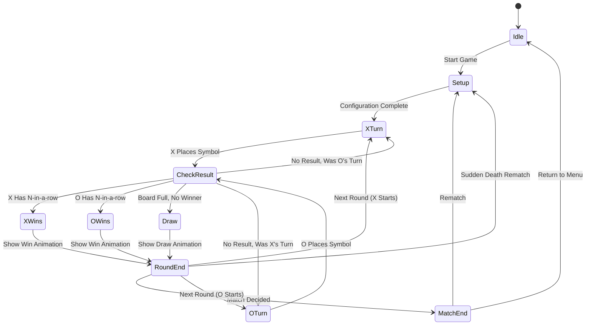

### 2.4.2 State Descriptions

| State | Description | Valid Actions |
|-------|-------------|---------------|
| **Idle** | No active game | Start new game, view statistics |
| **Setup** | Configuring game options | Select board size, N value, match length, opponents |
| **XTurn** | Waiting for X to move | Place symbol (X), Pause, Forfeit |
| **OTurn** | Waiting for O to move | Place symbol (O), Pause, Forfeit |
| **CheckResult** | Evaluating board state | None (automatic transition) |
| **XWins** | X achieved N-in-a-row | None (automatic transition) |
| **OWins** | O achieved N-in-a-row | None (automatic transition) |
| **Draw** | Board full, no winner | None (automatic transition) |
| **RoundEnd** | Round complete, showing result | Continue to next round, End match |
| **MatchEnd** | Match complete | Rematch, Return to menu |

### 2.4.3 State Transition Events

| Transition | Trigger | Guard Condition |
|------------|---------|-----------------|
| Idle → Setup | User selects "New Game" | - |
| Setup → XTurn | Configuration confirmed | Valid settings |
| XTurn → CheckResult | X places symbol | Cell was empty |
| OTurn → CheckResult | O places symbol | Cell was empty |
| CheckResult → XWins | Win check | X has N-in-a-row |
| CheckResult → OWins | Win check | O has N-in-a-row |
| CheckResult → Draw | Draw check | Board full, no winner |
| CheckResult → OTurn | No result | Was X's turn |
| CheckResult → XTurn | No result | Was O's turn |
| RoundEnd → MatchEnd | Round complete | Winner has majority |
| RoundEnd → XTurn/OTurn | Round complete | Match continues |

*Traces to: CORE-003, CORE-004*

---

## 2.5 Match Play

### 2.5.1 Match Structure

| Match Type | Rounds | Rounds to Win |
|------------|--------|---------------|
| Best of 3 | Up to 3 | 2 |
| Best of 5 | Up to 5 | 3 |
| Best of 7 | Up to 7 | 4 |

### 2.5.2 Match Scoring

| Round Result | X Points | O Points |
|--------------|----------|----------|
| X Wins | +1 | +0 |
| O Wins | +0 | +1 |
| Draw (Half-Point) | +0.5 | +0.5 |
| Draw (Sudden Death) | 0 | 0 (rematch) |

### 2.5.3 Match State Machine

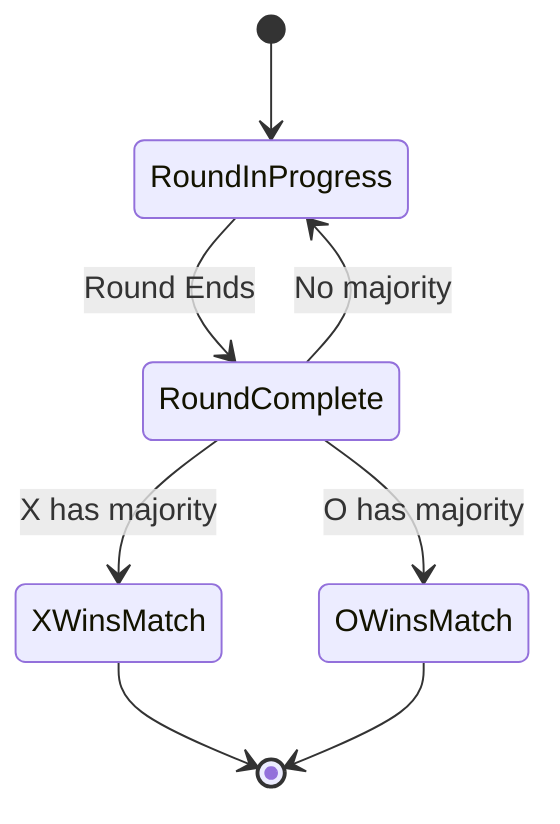

### 2.5.4 Starting Player Alternation

In match play, the starting player alternates between rounds:

| Round | Starting Player |
|-------|-----------------|
| 1 | X (always) |
| 2 | O |
| 3 | X |
| 4 | O |
| 5 | X |
| 6 | O |
| 7 | X |

This rule overrides the "loser goes first" rule for single games.

*Traces to: CORE-007, CORE-008*

---

## 2.6 Board Evaluation (for AI)

### 2.6.1 Line Scoring

Each win line is scored based on its state:

| Line State | Score (for AI) |
|------------|----------------|
| N AI symbols (win) | +∞ |
| N-1 AI symbols, 1 empty | +100 × (N-1) |
| N-2 AI symbols, rest empty | +10 × (N-2) |
| Mixed symbols | 0 (blocked) |
| N-1 opponent symbols, 1 empty | -100 × (N-1) |
| N opponent symbols (loss) | -∞ |

### 2.6.2 Board Heuristic

```
function EvaluateBoard(board, aiPlayer):
    opponent = (aiPlayer == X) ? O : X
    score = 0

    for each line in winLines:
        aiCount = CountSymbols(board, line, aiPlayer)
        oppCount = CountSymbols(board, line, opponent)
        emptyCount = n - aiCount - oppCount

        if oppCount == 0:  // Line available for AI
            score += aiCount * aiCount * 10
        elif aiCount == 0:  // Line available for opponent
            score -= oppCount * oppCount * 10
        // Mixed lines contribute 0

    // Centre and corner bonuses (positional)
    if board[centre] == aiPlayer:
        score += 30
    for each corner in corners:
        if board[corner] == aiPlayer:
            score += 20

    return score
```

*This section supports AI-003, AI-004*

---

# 3. Game Flow

## 3.1 Overall Game Flow

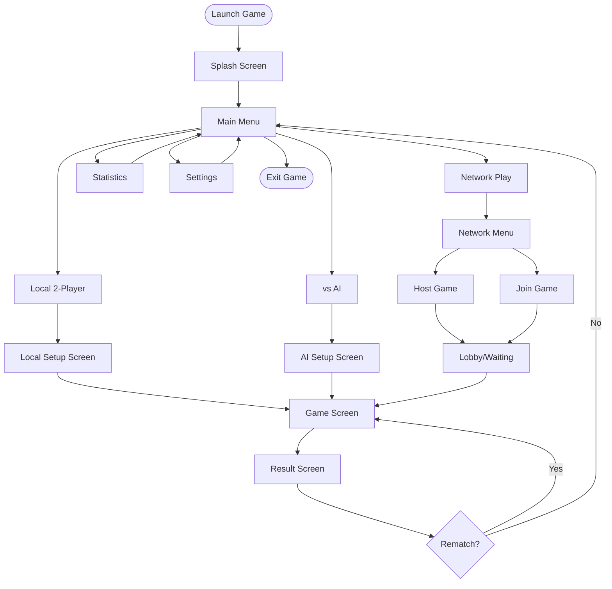

*Traces to: UI-002*

---

## 3.2 Screen Descriptions

### 3.2.1 Splash Screen
- **Duration**: 1-2 seconds (or until resources loaded)
- **Content**: Game logo, version number
- **Transition**: Automatic fade to Main Menu
- **Purpose**: Brand presentation while loading

### 3.2.2 Main Menu

```
┌────────────────────────────────────────┐
│              OXS                       │
│         Noughts & Crosses              │
│                                        │
│        ┌──────────────────┐            │
│        │  Local 2-Player  │            │
│        └──────────────────┘            │
│        ┌──────────────────┐            │
│        │     vs AI        │            │
│        └──────────────────┘            │
│        ┌──────────────────┐            │
│        │  Network Play    │            │
│        └──────────────────┘            │
│        ┌──────────────────┐            │
│        │   Statistics     │            │
│        └──────────────────┘            │
│        ┌──────────────────┐            │
│        │    Settings      │            │
│        └──────────────────┘            │
│        ┌──────────────────┐            │
│        │      Quit        │            │
│        └──────────────────┘            │
│                                        │
│                          v1.0          │
└────────────────────────────────────────┘
```

**Menu Options:**
| Option | Description | Next Screen |
|--------|-------------|-------------|
| Local 2-Player | Two players, same device | Local Setup |
| vs AI | Single player vs computer | AI Setup |
| Network Play | Online multiplayer | Network Menu |
| Statistics | View game history | Statistics Screen |
| Settings | Configure options | Settings Screen |
| Quit | Exit application | - |

---

## 3.3 Game Setup Flow

### 3.3.1 Local 2-Player Setup

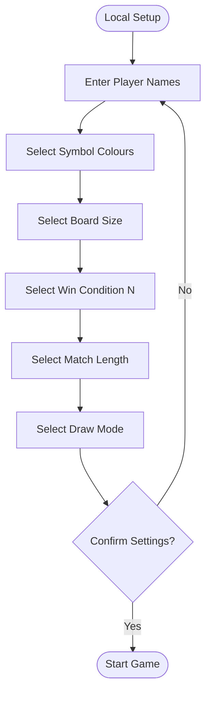

**Setup Options:**

| Setting | Options | Default |
|---------|---------|---------|
| Player 1 Name | Text input (max 16 chars) | "Player 1" |
| Player 2 Name | Text input (max 16 chars) | "Player 2" |
| Player 1 Colour | 8-colour palette | Blue |
| Player 2 Colour | 8-colour palette | Red |
| Board Size | 3×3, 4×4, 5×5 | 3×3 |
| Win Condition | 3, 4, 5 (constrained by board) | 3 |
| Match Length | Single, Best of 3/5/7 | Single |
| Draw Mode | Half-Point, Sudden Death | Half-Point |

*Traces to: LOCAL-003, LOCAL-004, CORE-001, CORE-002, CORE-005, CORE-007*

### 3.3.2 AI Setup

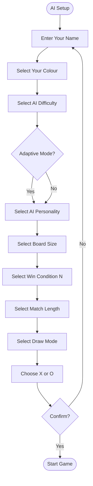

**AI-Specific Options:**

| Setting | Options | Default |
|---------|---------|---------|
| AI Difficulty | Easy, Medium, Hard | Medium |
| Adaptive Mode | On/Off | Off |
| AI Personality | Aggressive, Defensive, Balanced | Balanced |
| Your Symbol | X (go first), O (go second) | X |

*Traces to: AI-001, AI-005, AI-006*

### 3.3.3 Network Setup

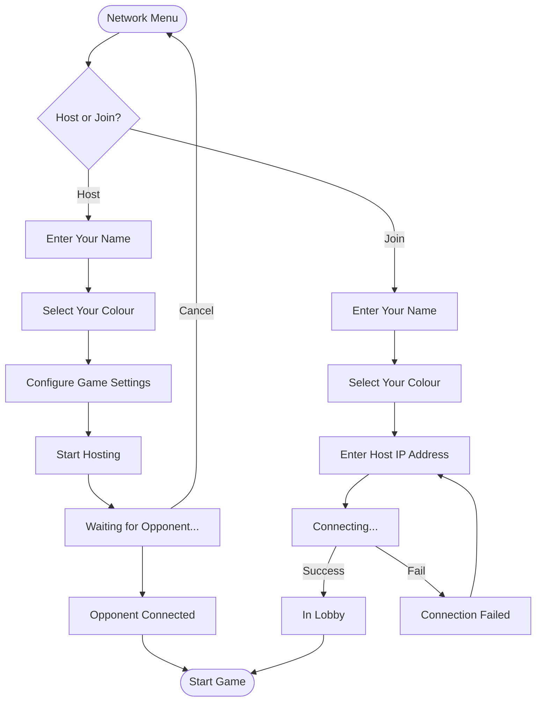

**Network-Specific Elements:**

| Element | Description |
|---------|-------------|
| Host IP Display | Shows host's IP for sharing |
| Connection Status | Connecting, Connected, Failed |
| Opponent Name | Displayed once connected |
| Ready Indicator | Both players must ready up |

*Traces to: NET-001, NET-008*

---

## 3.4 In-Game Flow

### 3.4.1 Turn Sequence

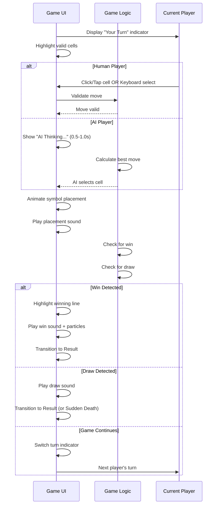

### 3.4.2 In-Game UI Elements

```
┌────────────────────────────────────────┐
│ Player 1 (X)  [●●○]  Player 2 (O)     │  ← Match score
│   Alice               Bob              │
├────────────────────────────────────────┤
│                                        │
│           ┌───┬───┬───┐               │
│           │ X │   │ O │               │
│           ├───┼───┼───┤               │
│           │   │ X │   │               │
│           ├───┼───┼───┤               │
│           │ O │   │   │               │  ← Game board
│           └───┴───┴───┘               │
│                                        │
│         ▶ Alice's Turn                 │  ← Turn indicator
│                                        │
├────────────────────────────────────────┤
│  [Pause]                    [Forfeit]  │  ← Action buttons
└────────────────────────────────────────┘
```

### 3.4.3 Pause Menu

When paused, the game displays:
- Resume Game
- Forfeit Round
- Forfeit Match
- Return to Main Menu (with confirmation)

Pause is available in Local and AI modes. In Network mode, pause notifies the opponent.

*Traces to: NFR-006 (no save/resume clarified as no mid-game persistence)*

---

## 3.5 End-Game Flow

### 3.5.1 Round End

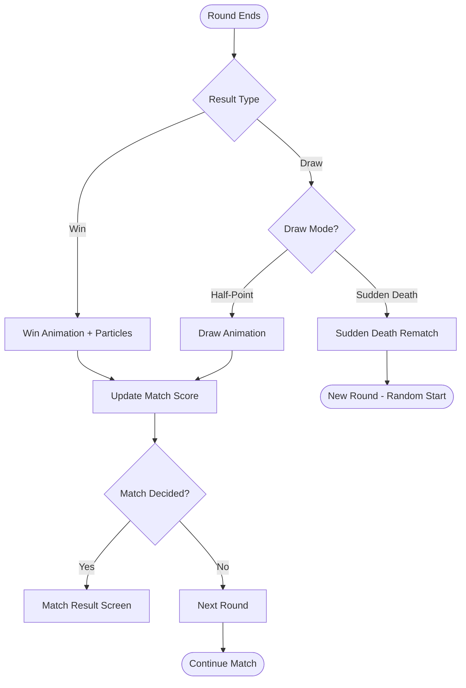

### 3.5.2 Result Screen

```
┌────────────────────────────────────────┐
│                                        │
│            🎉 WINNER! 🎉               │
│                                        │
│              ALICE                     │
│                                        │
│         Match Score: 2 - 1             │
│                                        │
│    ┌─────────────────────────────┐     │
│    │ Round 1:  Alice (X) wins    │     │
│    │ Round 2:  Bob (O) wins      │     │
│    │ Round 3:  Alice (X) wins    │     │
│    └─────────────────────────────┘     │
│                                        │
│        ┌──────────┐ ┌──────────┐       │
│        │ Rematch  │ │   Menu   │       │
│        └──────────┘ └──────────┘       │
│                                        │
└────────────────────────────────────────┘
```

**Result Screen Elements:**
| Element | Description |
|---------|-------------|
| Winner Announcement | Player name with celebration |
| Match Score | Final score (e.g., 2-1) |
| Round History | List of each round's result |
| Rematch Button | Start new match with same settings |
| Menu Button | Return to main menu |

*Traces to: UI-002, UI-003*

---

## 3.6 Statistics

### 3.6.1 Statistics Screen

```
┌────────────────────────────────────────┐
│              STATISTICS                │
├────────────────────────────────────────┤
│                                        │
│  Overall Record:                       │
│  ┌────────────────────────────────┐    │
│  │ Wins: 47  Losses: 23  Draws: 8 │    │
│  │ Win Rate: 60.3%                │    │
│  └────────────────────────────────┘    │
│                                        │
│  By Mode:                              │
│  ┌────────────────────────────────┐    │
│  │ Local:   W:12  L:10  D:3       │    │
│  │ vs AI:   W:25  L:8   D:4       │    │
│  │ Network: W:10  L:5   D:1       │    │
│  └────────────────────────────────┘    │
│                                        │
│  By Board Size:                        │
│  ┌────────────────────────────────┐    │
│  │ 3×3:  W:30  L:15  D:5          │    │
│  │ 4×4:  W:12  L:5   D:2          │    │
│  │ 5×5:  W:5   L:3   D:1          │    │
│  └────────────────────────────────┘    │
│                                        │
│  [Clear Statistics]        [Back]      │
└────────────────────────────────────────┘
```

### 3.6.2 Statistics Data

| Statistic | Tracked By |
|-----------|------------|
| Total Wins | Overall, Per Mode, Per Board Size |
| Total Losses | Overall, Per Mode, Per Board Size |
| Total Draws | Overall, Per Mode, Per Board Size |
| Win Rate | Calculated: Wins / (Wins + Losses) |
| Games Played | Sum of all outcomes |

### 3.6.3 Persistence

Statistics are saved to local storage (user preferences file) and persist across sessions:

```
// Statistics file structure (simplified)
{
    "overall": { "wins": 47, "losses": 23, "draws": 8 },
    "byMode": {
        "local": { "wins": 12, "losses": 10, "draws": 3 },
        "ai": { "wins": 25, "losses": 8, "draws": 4 },
        "network": { "wins": 10, "losses": 5, "draws": 1 }
    },
    "byBoardSize": {
        "3x3": { "wins": 30, "losses": 15, "draws": 5 },
        "4x4": { "wins": 12, "losses": 5, "draws": 2 },
        "5x5": { "wins": 5, "losses": 3, "draws": 1 }
    }
}
```

*Traces to: CORE-006*

---

## 3.7 Settings

### 3.7.1 Settings Options

| Setting | Options | Default | Persists |
|---------|---------|---------|----------|
| Master Volume | 0-100% | 80% | Yes |
| SFX Volume | 0-100% | 100% | Yes |
| Fullscreen | On/Off | Off | Yes |
| VSync | On/Off | On | Yes |
| Show FPS | On/Off | Off | Yes |
| Colour Scheme | Default, High Contrast | Default | Yes |

### 3.7.2 Settings Screen

```
┌────────────────────────────────────────┐
│              SETTINGS                  │
├────────────────────────────────────────┤
│                                        │
│  Audio                                 │
│  ├─ Master Volume  [████████░░] 80%    │
│  └─ SFX Volume     [██████████] 100%   │
│                                        │
│  Display                               │
│  ├─ Fullscreen     [ ] Off             │
│  ├─ VSync          [✓] On              │
│  └─ Show FPS       [ ] Off             │
│                                        │
│  Accessibility                         │
│  └─ Colour Scheme  [Default    ▼]      │
│                                        │
│                                        │
│        [Apply]              [Back]     │
└────────────────────────────────────────┘
```

*Traces to: UI-006, NFR-001*

---

# 4. AI Design

## 4.1 Difficulty Level Overview

| Level | Behaviour | Expected Win Rate vs Optimal Human | Algorithm |
|-------|-----------|-----------------------------------|-----------|
| **Easy** | Random valid moves | ~0% (AI loses almost always) | Random selection |
| **Medium** | Block/take immediate wins, some strategy | ~30-40% | Heuristic priority |
| **Hard** | Near-optimal play | ~85-95% (only draws possible for skilled players) | Minimax with pruning |

*Traces to: AI-001*

---

## 4.2 Easy AI

### 4.2.1 Behaviour

The Easy AI provides a gentle introduction for new players by making random moves without strategic consideration. It exists primarily to:
- Let beginners experience winning
- Provide a low-stress practice mode
- Demonstrate basic game mechanics

### 4.2.2 Algorithm

```
function EasyAI_GetMove(board):
    emptyCells = GetEmptyCells(board)

    if emptyCells.isEmpty():
        return null  // No valid moves (shouldn't happen if game logic correct)

    randomIndex = Random(0, emptyCells.length - 1)
    return emptyCells[randomIndex]
```

### 4.2.3 Expected Performance

| Board Size | N | Typical Outcome |
|------------|---|-----------------|
| 3×3 | 3 | Human wins in 3-5 turns |
| 4×4 | 3 | Human wins in 4-6 turns |
| 4×4 | 4 | Human wins in 5-7 turns |
| 5×5 | 3 | Human wins in 4-6 turns |
| 5×5 | 4 | Human wins in 6-8 turns |
| 5×5 | 5 | Human wins in 7-9 turns |

*Traces to: AI-002*

---

## 4.3 Medium AI

### 4.3.1 Behaviour

The Medium AI follows a priority-based heuristic system that:
- Always takes an immediate winning move if available
- Always blocks an opponent's immediate win if needed
- Makes reasonable strategic choices otherwise
- Occasionally makes suboptimal moves to remain beatable

### 4.3.2 Priority System

| Priority | Condition | Action |
|----------|-----------|--------|
| 1 (Highest) | AI can win this turn | Take the winning cell |
| 2 | Opponent can win next turn | Block the threatening cell |
| 3 | AI has N-2 in a line with open ends | Extend to N-1 |
| 4 | Centre cell available | Take centre |
| 5 | Corner cell available | Take a corner |
| 6 (Lowest) | Any valid move | Random selection |

### 4.3.3 Algorithm

```
function MediumAI_GetMove(board, aiSymbol, opponentSymbol, winLines, n):
    emptyCells = GetEmptyCells(board)

    // Priority 1: Win if possible
    winningMove = FindWinningMove(board, aiSymbol, winLines, n)
    if winningMove != null:
        return winningMove

    // Priority 2: Block opponent's win
    blockingMove = FindWinningMove(board, opponentSymbol, winLines, n)
    if blockingMove != null:
        return blockingMove

    // Priority 3: Create N-1 threat (with randomness for variety)
    if Random() < 0.7:  // 70% chance to play strategically
        threatMove = FindThreatMove(board, aiSymbol, winLines, n)
        if threatMove != null:
            return threatMove

    // Priority 4: Take centre
    centreIndex = GetCentreIndex(boardSize)
    if board[centreIndex] == Empty:
        return centreIndex

    // Priority 5: Take a corner
    corners = GetCornerIndices(boardSize)
    emptyCorners = corners.filter(c => board[c] == Empty)
    if emptyCorners.length > 0:
        return emptyCorners[Random(0, emptyCorners.length - 1)]

    // Priority 6: Random valid move
    return emptyCells[Random(0, emptyCells.length - 1)]


function FindWinningMove(board, symbol, winLines, n):
    for each line in winLines:
        symbolCount = 0
        emptyCell = null
        emptyCount = 0

        for each index in line:
            if board[index] == symbol:
                symbolCount++
            elif board[index] == Empty:
                emptyCell = index
                emptyCount++

        // Line has N-1 symbols and 1 empty = winning opportunity
        if symbolCount == n - 1 AND emptyCount == 1:
            return emptyCell

    return null


function FindThreatMove(board, symbol, winLines, n):
    bestMove = null
    bestScore = 0

    for each line in winLines:
        symbolCount = 0
        emptyCount = 0
        emptyCells = []

        for each index in line:
            if board[index] == symbol:
                symbolCount++
            elif board[index] == Empty:
                emptyCount++
                emptyCells.append(index)

        // Line has N-2 symbols and rest empty = good threat
        if symbolCount == n - 2 AND emptyCount == n - symbolCount:
            score = symbolCount * 10 + emptyCount
            if score > bestScore:
                bestScore = score
                bestMove = emptyCells[0]

    return bestMove
```

### 4.3.4 Expected Performance

| Board Size | N | Win Rate for Skilled Human |
|------------|---|---------------------------|
| 3×3 | 3 | 60-70% |
| 4×4 | 3 | 65-75% |
| 4×4 | 4 | 70-80% |
| 5×5 | 3 | 70-80% |
| 5×5 | 4 | 75-85% |
| 5×5 | 5 | 80-90% |

*Traces to: AI-003*

---

## 4.4 Hard AI (Minimax)

### 4.4.1 Behaviour

The Hard AI plays near-optimally using the Minimax algorithm with alpha-beta pruning. On a standard 3×3 board with N=3, perfect play guarantees at least a draw. However, to maintain player engagement and per requirement AI-004, the Hard AI introduces controlled imperfection to remain beatable 5-15% of the time.

### 4.4.2 Minimax Algorithm

```
function Minimax(board, depth, isMaximising, alpha, beta, aiSymbol, oppSymbol, winLines, n):
    // Terminal state checks
    if CheckWin(board, aiSymbol, winLines, n):
        return +1000 - depth  // Prefer faster wins
    if CheckWin(board, oppSymbol, winLines, n):
        return -1000 + depth  // Delay losses
    if IsBoardFull(board):
        return 0  // Draw

    // Depth limit for larger boards
    maxDepth = GetMaxDepth(boardSize, n)
    if depth >= maxDepth:
        return EvaluateBoard(board, aiSymbol, oppSymbol, winLines, n)

    if isMaximising:
        maxEval = -INFINITY
        for each cell in GetEmptyCells(board):
            board[cell] = aiSymbol
            eval = Minimax(board, depth + 1, false, alpha, beta, aiSymbol, oppSymbol, winLines, n)
            board[cell] = Empty
            maxEval = max(maxEval, eval)
            alpha = max(alpha, eval)
            if beta <= alpha:
                break  // Alpha-beta pruning
        return maxEval
    else:
        minEval = +INFINITY
        for each cell in GetEmptyCells(board):
            board[cell] = oppSymbol
            eval = Minimax(board, depth + 1, true, alpha, beta, aiSymbol, oppSymbol, winLines, n)
            board[cell] = Empty
            minEval = min(minEval, eval)
            beta = min(beta, eval)
            if beta <= alpha:
                break  // Alpha-beta pruning
        return minEval
```

### 4.4.3 Move Selection with Controlled Imperfection

```
function HardAI_GetMove(board, aiSymbol, oppSymbol, winLines, n, imperfectionRate = 0.10):
    emptyCells = GetEmptyCells(board)
    moves = []

    // Evaluate all possible moves
    for each cell in emptyCells:
        board[cell] = aiSymbol
        score = Minimax(board, 0, false, -INFINITY, +INFINITY, aiSymbol, oppSymbol, winLines, n)
        board[cell] = Empty
        moves.append({ cell: cell, score: score })

    // Sort by score (best first)
    moves.sortByScoreDescending()

    // Controlled imperfection: occasionally pick suboptimal move
    if Random() < imperfectionRate AND moves.length > 1:
        // Pick from top 3 moves with weighted probability
        weights = [0.6, 0.3, 0.1]  // Heavily favour better moves
        selectedIndex = WeightedRandom(0, min(3, moves.length) - 1, weights)
        return moves[selectedIndex].cell

    return moves[0].cell  // Best move
```

### 4.4.4 Depth Limits for Performance

| Board Size | N | Max Depth | Rationale |
|------------|---|-----------|-----------|
| 3×3 | 3 | 9 (unlimited) | Full tree search possible |
| 4×4 | 3 | 8 | Balance between strength and speed |
| 4×4 | 4 | 10 | Slightly deeper for more complex games |
| 5×5 | 3 | 6 | Limited for performance |
| 5×5 | 4 | 8 | Moderate depth |
| 5×5 | 5 | 10 | Deeper search worthwhile |

### 4.4.5 Board Evaluation Heuristic (for depth-limited search)

```
function EvaluateBoard(board, aiSymbol, oppSymbol, winLines, n):
    score = 0

    for each line in winLines:
        aiCount = CountSymbol(board, line, aiSymbol)
        oppCount = CountSymbol(board, line, oppSymbol)

        if oppCount == 0:  // Line available for AI
            score += aiCount * aiCount * 10
        elif aiCount == 0:  // Line available for opponent
            score -= oppCount * oppCount * 10
        // Mixed lines = 0 (blocked)

    // Positional bonuses
    centre = GetCentreIndex(boardSize)
    if board[centre] == aiSymbol:
        score += 30
    elif board[centre] == oppSymbol:
        score -= 30

    corners = GetCornerIndices(boardSize)
    for each corner in corners:
        if board[corner] == aiSymbol:
            score += 15
        elif board[corner] == oppSymbol:
            score -= 15

    return score
```

### 4.4.6 Expected Performance

| Board Size | N | Skilled Human Win Rate |
|------------|---|------------------------|
| 3×3 | 3 | 5-10% (mostly draws) |
| 4×4 | 3 | 10-15% |
| 4×4 | 4 | 8-12% |
| 5×5 | 3 | 12-18% |
| 5×5 | 4 | 10-15% |
| 5×5 | 5 | 8-12% |

*Traces to: AI-004*

---

## 4.5 Adaptive AI Mode

### 4.5.1 Behaviour

The Adaptive AI dynamically adjusts its effective difficulty based on the player's recent performance, keeping games challenging but not frustrating.

### 4.5.2 Performance Tracking

```
// Tracked per session
AdaptiveState = {
    recentResults: Queue(maxSize: 10),  // Last 10 game results
    currentLevel: "Medium",              // Easy, Medium, Hard
    consecutiveWins: 0,
    consecutiveLosses: 0
}
```

### 4.5.3 Adaptation Rules

| Condition | Action |
|-----------|--------|
| Player wins 3 consecutive games | Increase difficulty |
| Player loses 3 consecutive games | Decrease difficulty |
| Mixed results | Maintain current level |

```
function UpdateAdaptiveLevel(result):
    if result == PlayerWin:
        consecutiveWins++
        consecutiveLosses = 0
        if consecutiveWins >= 3:
            IncreaseLevel()
            consecutiveWins = 0
    elif result == PlayerLoss:
        consecutiveLosses++
        consecutiveWins = 0
        if consecutiveLosses >= 3:
            DecreaseLevel()
            consecutiveLosses = 0
    else:  // Draw
        // Don't reset streaks, draws are neutral
        pass


function IncreaseLevel():
    if currentLevel == "Easy":
        currentLevel = "Medium"
    elif currentLevel == "Medium":
        currentLevel = "Hard"
    // Hard is maximum


function DecreaseLevel():
    if currentLevel == "Hard":
        currentLevel = "Medium"
    elif currentLevel == "Medium":
        currentLevel = "Easy"
    // Easy is minimum
```

### 4.5.4 Hybrid Approach

When adaptive mode is enabled, the AI uses a weighted blend between levels during transitions:

```
function AdaptiveAI_GetMove(board, ...):
    level = GetCurrentAdaptiveLevel()

    switch level:
        case "Easy":
            return EasyAI_GetMove(board)
        case "Medium":
            return MediumAI_GetMove(board, ...)
        case "Hard":
            return HardAI_GetMove(board, ...)
```

*Traces to: AI-005*

---

## 4.6 AI Personalities

### 4.6.1 Personality Definitions

| Personality | Behaviour | Weight Distribution |
|-------------|-----------|---------------------|
| **Aggressive** | Prefers offensive moves, builds multiple threats | Attack: 70%, Defence: 30% |
| **Defensive** | Prefers blocking, avoids risky positions | Attack: 30%, Defence: 70% |
| **Balanced** | Equal consideration of attack and defence | Attack: 50%, Defence: 50% |

### 4.6.2 Personality Implementation (Medium AI)

```
function MediumAI_GetMove_WithPersonality(board, ..., personality):
    emptyCells = GetEmptyCells(board)

    // Priority 1 is always unchanged: Win if possible
    winningMove = FindWinningMove(board, aiSymbol, winLines, n)
    if winningMove != null:
        return winningMove

    // Priority 2: Block - but personality affects urgency
    blockingMove = FindWinningMove(board, opponentSymbol, winLines, n)
    if blockingMove != null:
        if personality == "Aggressive":
            // 80% chance to block, 20% to ignore (risky play)
            if Random() < 0.8:
                return blockingMove
        else:
            // Defensive and Balanced always block
            return blockingMove

    // Weighted move selection based on personality
    attackMoves = FindThreatMoves(board, aiSymbol, winLines, n)
    defenseMoves = FindBlockingMoves(board, opponentSymbol, winLines, n)

    weights = GetPersonalityWeights(personality)

    if Random() < weights.attack AND attackMoves.length > 0:
        return attackMoves[Random(0, attackMoves.length - 1)]
    elif defenseMoves.length > 0:
        return defenseMoves[Random(0, defenseMoves.length - 1)]

    // Fallback to standard priority
    return StandardPriorityMove(board, ...)


function GetPersonalityWeights(personality):
    switch personality:
        case "Aggressive": return { attack: 0.7, defence: 0.3 }
        case "Defensive":  return { attack: 0.3, defence: 0.7 }
        case "Balanced":   return { attack: 0.5, defence: 0.5 }
```

### 4.6.3 Personality Effects on Hard AI

For Hard AI, personality affects move selection when multiple moves have similar scores:

```
function HardAI_GetMove_WithPersonality(board, ..., personality):
    moves = EvaluateAllMoves(board, ...)

    // Find moves within threshold of best score
    bestScore = moves[0].score
    threshold = 50  // Points within which moves are "equal"
    equalMoves = moves.filter(m => bestScore - m.score < threshold)

    if equalMoves.length > 1:
        // Use personality to choose among equal moves
        return SelectByPersonality(equalMoves, personality, board)

    return moves[0].cell


function SelectByPersonality(equalMoves, personality, board):
    for each move in equalMoves:
        move.attackScore = CountThreatsCreated(board, move.cell, aiSymbol)
        move.defenceScore = CountThreatsBlocked(board, move.cell, oppSymbol)

    weights = GetPersonalityWeights(personality)

    for each move in equalMoves:
        move.personalityScore = move.attackScore * weights.attack +
                                move.defenceScore * weights.defence

    return equalMoves.maxBy(m => m.personalityScore).cell
```

*Traces to: AI-006*

---

## 4.7 AI Timing

### 4.7.1 Thinking Delay

To create a natural feel, the AI introduces an artificial delay before making its move:

| Difficulty | Delay Range | Purpose |
|------------|-------------|---------|
| Easy | 0.5 - 0.8 seconds | Feel responsive |
| Medium | 0.6 - 1.0 seconds | Simulate thinking |
| Hard | 0.7 - 1.2 seconds | Simulate deep analysis |

### 4.7.2 Implementation

```
function AI_MakeMove(board, difficulty, ...):
    // Calculate move immediately (for responsiveness)
    selectedMove = CalculateMove(board, difficulty, ...)

    // Determine delay
    minDelay = GetMinDelay(difficulty)
    maxDelay = GetMaxDelay(difficulty)
    delay = Random(minDelay, maxDelay)

    // Show "thinking" indicator
    ShowThinkingIndicator()

    // Wait for delay
    Wait(delay)

    // Hide indicator and make move
    HideThinkingIndicator()
    return selectedMove


function GetMinDelay(difficulty):
    switch difficulty:
        case "Easy": return 0.5
        case "Medium": return 0.6
        case "Hard": return 0.7

function GetMaxDelay(difficulty):
    switch difficulty:
        case "Easy": return 0.8
        case "Medium": return 1.0
        case "Hard": return 1.2
```

### 4.7.3 Thinking Indicator

During the delay, the UI displays:
- "Thinking..." text near the AI player indicator
- Animated ellipsis or spinner
- Optional: subtle animation of the AI's symbol

*Traces to: AI-007*

---

## 4.8 Difficulty Lock

### 4.8.1 Rule

Once a game begins, the AI difficulty level cannot be changed until the game (or match) concludes. This prevents:
- Exploiting easy AI to gain an advantage
- Frustration from accidental difficulty changes
- Inconsistent game statistics

### 4.8.2 Implementation

```
GameState = {
    difficultyLocked: false,
    currentDifficulty: null
}

function StartGame(difficulty):
    GameState.currentDifficulty = difficulty
    GameState.difficultyLocked = true

function EndGame():
    GameState.difficultyLocked = false

function ChangeDifficulty(newDifficulty):
    if GameState.difficultyLocked:
        // Show message: "Cannot change difficulty during a game"
        return false
    GameState.currentDifficulty = newDifficulty
    return true
```

### 4.8.3 UI Behaviour

- Difficulty selector is disabled/greyed out during active gameplay
- Tooltip explains: "Difficulty cannot be changed during a game"
- Setting is re-enabled after game ends or player forfeits

*Traces to: AI-008*

---

# 5. Multiplayer Design

## 5.1 Local 2-Player

### 5.1.1 Overview

Local 2-Player mode allows two players to compete on the same device, taking turns using shared input devices (mouse/keyboard).

### 5.1.2 Turn Management

```
┌────────────────────────────────────────┐
│         TURN INDICATOR DISPLAY         │
├────────────────────────────────────────┤
│                                        │
│   ┌─────────┐         ┌─────────┐     │
│   │  ALICE  │         │   BOB   │     │
│   │    X    │         │    O    │     │
│   │  [2]    │         │   [1]   │     │
│   └────┬────┘         └────┬────┘     │
│        │                   │          │
│        ▼                   │          │
│   ┌─────────┐              │          │
│   │ ▶ YOUR  │              │          │
│   │  TURN   │              │          │
│   └─────────┘              │          │
│                                        │
└────────────────────────────────────────┘
```

**Turn Indicator Elements:**
| Element | Description |
|---------|-------------|
| Player Name | Displayed above symbol |
| Symbol | X or O in player's colour |
| Round Score | Current match score [wins] |
| Active Indicator | Arrow/highlight showing whose turn |

### 5.1.3 Input Handling

Both players share the same input devices:

**Mouse/Touch:**
- Click/tap on valid cell to place symbol
- Hover highlights valid cells
- Invalid cells show blocked cursor

**Keyboard:**
- Arrow keys navigate between cells
- Enter/Space places symbol in highlighted cell
- Tab cycles through cells
- Escape opens pause menu

```
function HandleInput(inputEvent):
    if not IsCurrentPlayerHuman():
        return  // AI turn, ignore input

    if inputEvent is MouseClick:
        cell = GetCellAtPosition(inputEvent.position)
        if cell != null AND IsValidMove(cell):
            PlaceSymbol(cell)

    elif inputEvent is KeyPress:
        switch inputEvent.key:
            case Arrow:
                MoveHighlight(inputEvent.direction)
            case Enter, Space:
                if highlightedCell != null AND IsValidMove(highlightedCell):
                    PlaceSymbol(highlightedCell)
            case Escape:
                OpenPauseMenu()
```

### 5.1.4 Player Identification

| Aspect | Implementation |
|--------|----------------|
| Names | Custom names entered in setup |
| Symbols | X always first, O always second |
| Colours | Player-selected from palette |
| Avatars | Not implemented (names only) |

*Traces to: LOCAL-001, LOCAL-002, LOCAL-003, LOCAL-004*

---

## 5.2 Networked Multiplayer

### 5.2.1 Architecture Overview

OXS uses a **host-client** architecture where:
- The **host** creates the game and is authoritative for game state
- The **client** connects to the host via direct IP
- All game logic executes on the host; client sends inputs and receives state

```
┌─────────────────────────────────────────────────────────────┐
│                    HOST-CLIENT ARCHITECTURE                  │
└─────────────────────────────────────────────────────────────┘

    ┌──────────┐                         ┌──────────┐
    │   HOST   │◄───────────────────────►│  CLIENT  │
    │ (Player 1)│     Network (ENet)     │ (Player 2)│
    └────┬─────┘                         └────┬─────┘
         │                                    │
         │  Authoritative                     │  Input Only
         │  • Game state                      │  • Send moves
         │  • Win detection                   │  • Receive state
         │  • Turn management                 │  • Display UI
         │  • Validation                      │
         │                                    │
    ┌────┴────┐                          ┌────┴────┐
    │  Game   │                          │  Game   │
    │  Logic  │                          │  Mirror │
    └─────────┘                          └─────────┘
```

*Traces to: NET-002*

### 5.2.2 Connection Flow

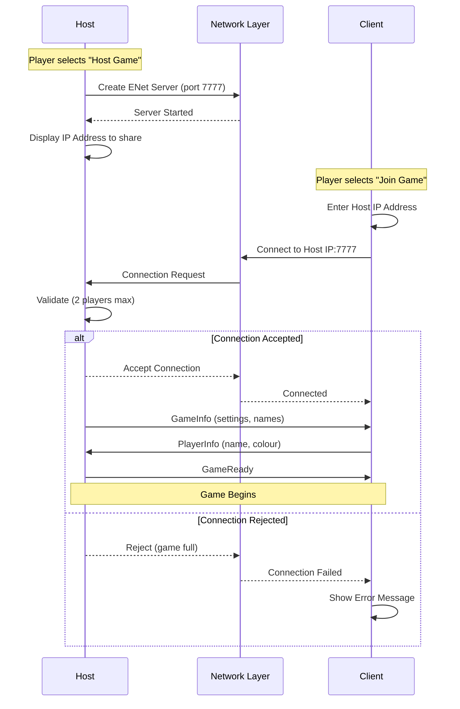

*Traces to: NET-001, NET-008*

### 5.2.3 Connection States

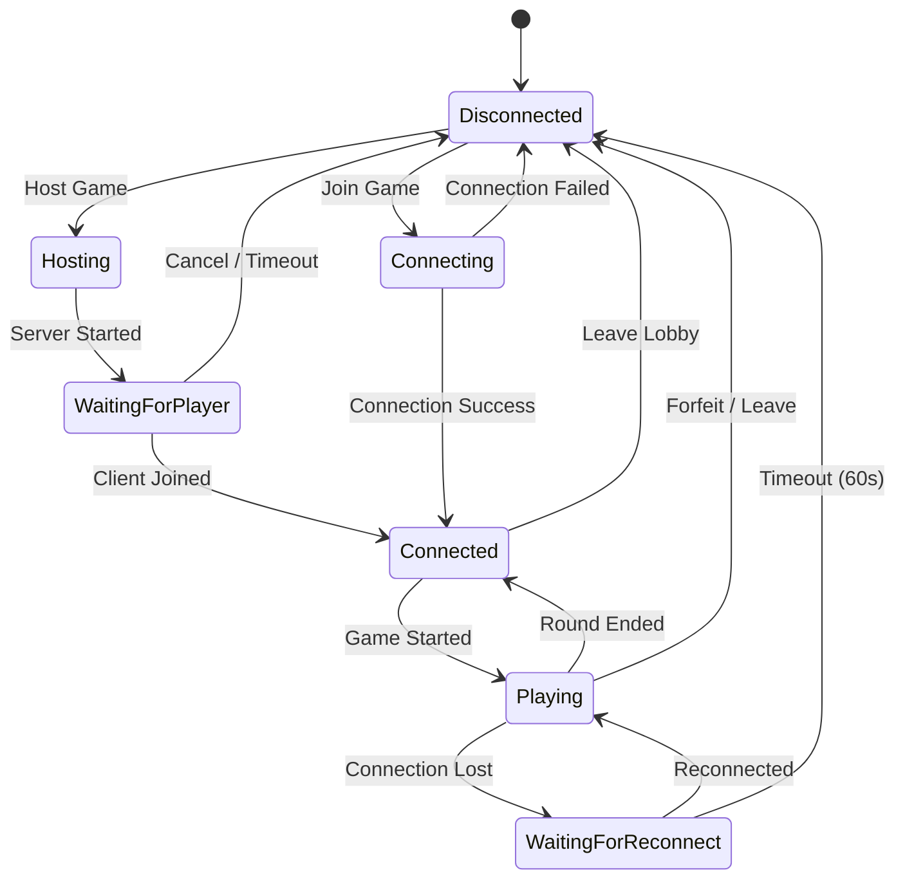

### 5.2.4 State Descriptions

| State | Host Behaviour | Client Behaviour |
|-------|----------------|------------------|
| **Disconnected** | No server running | No connection |
| **Hosting** | Starting ENet server | N/A |
| **WaitingForPlayer** | Server running, awaiting client | N/A |
| **Connecting** | N/A | Attempting to connect |
| **Connected** | Client in lobby | In lobby, awaiting game |
| **Playing** | Processing game, sending state | Receiving state, sending input |
| **WaitingForReconnect** | Paused, awaiting client | Attempting reconnect |

### 5.2.5 Network Messages

| Message | Direction | Payload | Purpose |
|---------|-----------|---------|---------|
| `CONNECT_REQUEST` | Client → Host | Player name, colour | Request to join |
| `CONNECT_ACCEPT` | Host → Client | Game settings | Connection approved |
| `CONNECT_REJECT` | Host → Client | Reason code | Connection denied |
| `GAME_START` | Host → Client | Initial state | Begin game |
| `PLAYER_MOVE` | Client → Host | Cell index | Client's move |
| `STATE_UPDATE` | Host → Client | Full board state, turn, scores | Sync game state |
| `ROUND_END` | Host → Client | Result, winner, scores | Round completed |
| `MATCH_END` | Host → Client | Final result, stats | Match completed |
| `PING` | Bidirectional | Timestamp | Latency check |
| `PONG` | Bidirectional | Timestamp | Latency response |
| `DISCONNECT` | Bidirectional | Reason | Graceful disconnect |
| `RECONNECT` | Client → Host | Session token | Reconnection attempt |

### 5.2.6 Message Structures

```
// Connect Request
{
    type: "CONNECT_REQUEST",
    playerName: string,
    playerColour: int,
    protocolVersion: int
}

// State Update (sent after every move)
{
    type: "STATE_UPDATE",
    board: int[],           // Cell states (0=empty, 1=X, 2=O)
    currentTurn: int,       // 1=X, 2=O
    hostScore: float,       // Match score
    clientScore: float,
    roundNumber: int,
    timestamp: long
}

// Player Move
{
    type: "PLAYER_MOVE",
    cellIndex: int,
    timestamp: long
}

// Round End
{
    type: "ROUND_END",
    result: int,            // 0=draw, 1=host wins, 2=client wins
    winningLine: int[],     // Indices of winning cells (if win)
    hostScore: float,
    clientScore: float
}
```

*Traces to: NET-003*

---

## 5.3 Game State Synchronisation

### 5.3.1 Authority Model

| Aspect | Authority | Reason |
|--------|-----------|--------|
| Move Validation | Host | Prevent cheating |
| Win Detection | Host | Ensure consistency |
| Turn Management | Host | Authoritative state |
| Score Tracking | Host | Single source of truth |
| Game Settings | Host | Set at game creation |

### 5.3.2 Synchronisation Protocol

```
// Host processes move
function Host_OnPlayerMove(moveMessage):
    if moveMessage.sender != GetCurrentPlayer():
        return  // Not their turn

    if not IsValidMove(moveMessage.cellIndex):
        SendError(moveMessage.sender, "Invalid move")
        return

    // Apply move locally
    ApplyMove(moveMessage.cellIndex)

    // Check for game end
    result = CheckGameResult()

    // Broadcast state to client
    SendStateUpdate()

    if result != null:
        SendRoundEnd(result)


// Client receives state
function Client_OnStateUpdate(stateMessage):
    // Apply authoritative state
    board = stateMessage.board
    currentTurn = stateMessage.currentTurn
    scores = (stateMessage.hostScore, stateMessage.clientScore)

    // Update UI
    RefreshBoard()
    UpdateTurnIndicator()
    UpdateScoreDisplay()
```

### 5.3.3 Latency Handling

Target: State synchronisation within 200ms of move

```
// Optimistic UI (optional enhancement)
function Client_OnLocalInput(cellIndex):
    // Show move immediately (optimistic)
    ShowPendingMove(cellIndex)

    // Send to host
    SendPlayerMove(cellIndex)

    // If state update doesn't arrive within timeout, revert
    StartTimeout(300ms, RevertPendingMove)


function Client_OnStateUpdate(stateMessage):
    CancelTimeout()
    // Authoritative state overwrites any pending
    ApplyAuthoritativeState(stateMessage)
```

For a turn-based game like OXS, the simple approach (wait for host confirmation) is preferred over optimistic updates to avoid visual glitches.

*Traces to: NET-003, NFR-007*

---

## 5.4 Disconnection Handling

### 5.4.1 Disconnect Detection

| Method | Trigger | Timeout |
|--------|---------|---------|
| ENet Timeout | No packets received | 5 seconds |
| Ping Timeout | No pong response | 3 seconds |
| TCP Disconnect | Connection closed | Immediate |

### 5.4.2 Disconnect Flow

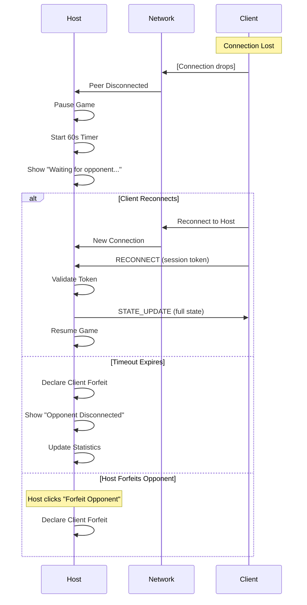

*Traces to: NET-004, NET-005, NET-006*

### 5.4.3 Reconnection State

```
ReconnectionState = {
    sessionToken: string,       // Generated at game start
    lastKnownState: GameState,  // Full game state for resume
    disconnectTime: timestamp,
    timeoutDuration: 60000      // 60 seconds in ms
}

function StartReconnectionWait():
    isPaused = true
    ShowReconnectionUI()
    StartTimer(timeoutDuration, OnReconnectionTimeout)

function OnReconnectionAttempt(token):
    if token == sessionToken:
        CancelTimer()
        SendFullState()
        isPaused = false
        HideReconnectionUI()
        return true
    return false

function OnReconnectionTimeout():
    DeclareForeit(disconnectedPlayer)
    EndMatch()
```

### 5.4.4 Reconnection UI

```
┌────────────────────────────────────────┐
│                                        │
│       Waiting for opponent...          │
│                                        │
│           ┌──────────────┐             │
│           │    0:47      │             │  ← Countdown timer
│           └──────────────┘             │
│                                        │
│    Opponent disconnected. Waiting      │
│    for reconnection.                   │
│                                        │
│    ┌────────────────────────────┐      │
│    │    Forfeit Opponent        │      │  ← Optional early end
│    └────────────────────────────┘      │
│                                        │
│    ┌────────────────────────────┐      │
│    │    Return to Menu          │      │  ← Abandon match
│    └────────────────────────────┘      │
│                                        │
└────────────────────────────────────────┘
```

*Traces to: NET-005, NET-006*

---

## 5.5 Network Constraints

### 5.5.1 No Text Chat

Per requirement NET-007, text chat is explicitly excluded:
- No chat input field
- No message display area
- No emoji or quick-chat options
- Communication happens outside the game (Discord, etc.)

*Traces to: NET-007*

### 5.5.2 Two Players Only

Per requirement NET-008:
- Maximum connections: 2 (host + 1 client)
- No spectator mode
- Additional connection attempts are rejected with "Game Full" message

```
function Host_OnConnectionRequest(peer):
    if connectedPlayers >= 1:  // Already have a client
        SendReject(peer, "GAME_FULL")
        peer.Disconnect()
        return

    // Accept the connection
    connectedPlayers++
    SendAccept(peer)
```

*Traces to: NET-008*

---

## 5.6 Network Error Handling

### 5.6.1 Error Types

| Error | Cause | User Message | Recovery |
|-------|-------|--------------|----------|
| Connection Failed | Host unreachable | "Could not connect to host" | Retry or return to menu |
| Connection Timeout | No response | "Connection timed out" | Retry or return to menu |
| Game Full | Host has opponent | "Game is full" | Return to menu |
| Invalid Move | Desync or cheat | "Move rejected by host" | Request state resync |
| Protocol Mismatch | Version difference | "Incompatible game version" | Update game |

### 5.6.2 Error Messages

```
function ShowNetworkError(errorType):
    message = switch errorType:
        case CONNECTION_FAILED: "Could not connect to host. Check the IP address and try again."
        case TIMEOUT: "Connection timed out. The host may be unavailable."
        case GAME_FULL: "This game is full. Only 2 players can join."
        case INVALID_MOVE: "Your move was rejected. Synchronising..."
        case VERSION_MISMATCH: "Game version mismatch. Please update to the latest version."

    ShowDialog(message, buttons: ["OK"])
```

*Traces to: NFR-003*

---

## 5.7 Network Technical Details

### 5.7.1 Godot ENet Integration

OXS uses Godot's built-in high-level multiplayer API with ENet:

```
// Host setup (C# pseudocode)
var peer = new ENetMultiplayerPeer();
peer.CreateServer(7777, 1);  // Port 7777, max 1 client
Multiplayer.MultiplayerPeer = peer;

// Client setup
var peer = new ENetMultiplayerPeer();
peer.CreateClient(hostIp, 7777);
Multiplayer.MultiplayerPeer = peer;
```

### 5.7.2 Port Configuration

| Setting | Value | Configurable |
|---------|-------|--------------|
| Default Port | 7777 | Yes (in settings) |
| Protocol | UDP (via ENet) | No |
| Max Clients | 1 | No |

### 5.7.3 NAT Considerations

OXS uses direct IP connection and does NOT include:
- NAT punch-through
- STUN/TURN servers
- Relay servers

Players on the same local network or with port forwarding configured can connect directly. For players behind NAT, they must:
1. Configure port forwarding (port 7777) on their router
2. Use a VPN solution (e.g., Hamachi, ZeroTier)

*Traces to: CON-004, NET-001*

---

# 6. UI/UX Design

## 6.1 Screen Map

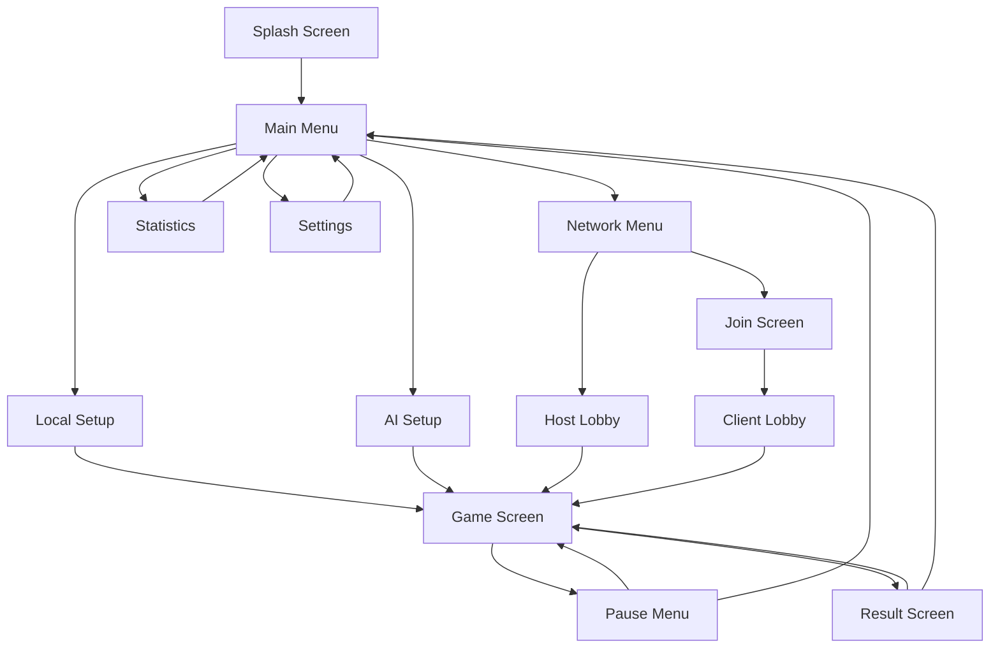

### 6.1.1 Screen Inventory

| Screen | Purpose | Entry Points |
|--------|---------|--------------|
| Splash | Brand display, loading | App launch |
| Main Menu | Navigation hub | App start, return from game |
| Local Setup | Configure local 2P game | Main menu |
| AI Setup | Configure vs AI game | Main menu |
| Network Menu | Host or join selection | Main menu |
| Host Lobby | Wait for opponent | Network menu |
| Join Screen | Enter host IP | Network menu |
| Client Lobby | Connected, waiting | Join screen |
| Game Screen | Active gameplay | Any setup screen |
| Pause Menu | Pause options | Game screen (Esc) |
| Result Screen | Game outcome | Game end |
| Statistics | View history | Main menu |
| Settings | Configure options | Main menu |

---

## 6.2 Main Menu

### 6.2.1 Layout

```
┌────────────────────────────────────────────────────────────┐
│                                                            │
│                         ╔═══════════╗                      │
│                         ║    OXS    ║                      │
│                         ╚═══════════╝                      │
│                    Noughts & Crosses                       │
│                                                            │
│                                                            │
│                   ┌─────────────────────┐                  │
│                   │   Local 2-Player    │                  │
│                   └─────────────────────┘                  │
│                                                            │
│                   ┌─────────────────────┐                  │
│                   │       vs AI         │                  │
│                   └─────────────────────┘                  │
│                                                            │
│                   ┌─────────────────────┐                  │
│                   │    Network Play     │                  │
│                   └─────────────────────┘                  │
│                                                            │
│                   ┌─────────────────────┐                  │
│                   │     Statistics      │                  │
│                   └─────────────────────┘                  │
│                                                            │
│                   ┌─────────────────────┐                  │
│                   │      Settings       │                  │
│                   └─────────────────────┘                  │
│                                                            │
│                   ┌─────────────────────┐                  │
│                   │        Quit         │                  │
│                   └─────────────────────┘                  │
│                                                            │
│                                               v1.0.0       │
└────────────────────────────────────────────────────────────┘
```

### 6.2.2 Element Specifications

| Element | Position | Behaviour |
|---------|----------|-----------|
| Logo | Top centre, 20% from top | Subtle idle animation (glow/pulse) |
| Subtitle | Below logo | Static text |
| Menu Buttons | Centre, stacked vertically | Highlight on hover, click to select |
| Version | Bottom right | Static text |

### 6.2.3 Keyboard Navigation

| Key | Action |
|-----|--------|
| ↑/↓ | Move selection |
| Enter | Activate selected button |
| Escape | Quit (with confirmation) |

---

## 6.3 Game Screen

### 6.3.1 Layout

```
┌────────────────────────────────────────────────────────────┐
│  ┌────────────────────────────────────────────────────┐    │
│  │  Player 1          ROUND 2 of 3          Player 2  │    │
│  │    Alice                                    Bob    │    │
│  │  ┌─────┐               │                ┌─────┐   │    │
│  │  │  X  │ Score: 1      │      Score: 0  │  O  │   │    │
│  │  └─────┘               │                └─────┘   │    │
│  └────────────────────────────────────────────────────┘    │
│                                                            │
│                    ┌─────┬─────┬─────┐                     │
│                    │     │     │     │                     │
│                    │  X  │     │  O  │                     │
│                    │     │     │     │                     │
│                    ├─────┼─────┼─────┤                     │
│                    │     │     │     │                     │
│                    │     │  X  │     │                     │
│                    │     │     │     │                     │
│                    ├─────┼─────┼─────┤                     │
│                    │     │     │     │                     │
│                    │  O  │     │     │                     │
│                    │     │     │     │                     │
│                    └─────┴─────┴─────┘                     │
│                                                            │
│                      ▶ Alice's Turn                        │
│                                                            │
│  ┌────────┐                                  ┌──────────┐  │
│  │ Pause  │                                  │ Forfeit  │  │
│  └────────┘                                  └──────────┘  │
└────────────────────────────────────────────────────────────┘
```

### 6.3.2 Component Specifications

**Header Bar:**
| Element | Content | Notes |
|---------|---------|-------|
| Player 1 Info | Name, symbol, score | Left aligned |
| Round Indicator | "ROUND X of Y" | Centre |
| Player 2 Info | Name, symbol, score | Right aligned |

**Game Board:**
| Aspect | Specification |
|--------|---------------|
| Size | 60% of smallest viewport dimension |
| Cell Size | Board size / grid size |
| Grid Lines | 4px solid, neutral colour |
| Cell Highlight | Subtle glow on hover |
| Symbol Size | 80% of cell size |
| Symbol Animation | Scale in + slight rotation on place |

**Turn Indicator:**
| State | Display |
|-------|---------|
| Human Turn | "▶ [Name]'s Turn" with pulse animation |
| AI Turn | "AI Thinking..." with spinner |
| Network Waiting | "Waiting for [Name]..." |

**Action Buttons:**
| Button | Position | Action |
|--------|----------|--------|
| Pause | Bottom left | Opens pause menu |
| Forfeit | Bottom right | Forfeits current round |

### 6.3.3 Board Scaling by Size

| Board | Cell Count | Recommended Cell Size |
|-------|------------|----------------------|
| 3×3 | 9 | 120px minimum |
| 4×4 | 16 | 90px minimum |
| 5×5 | 25 | 72px minimum |

---

## 6.4 Responsive Design

### 6.4.1 Supported Resolutions

| Category | Resolution Range | Aspect Ratios |
|----------|------------------|---------------|
| HD | 1280×720 to 1920×1080 | 16:9 |
| QHD | 2560×1440 | 16:9 |
| 4K | 3840×2160 | 16:9 |
| Ultrawide | 2560×1080, 3440×1440 | 21:9 |
| Legacy | 1024×768, 1280×1024 | 4:3 |
| Tablet | 1280×800 | 16:10 |

### 6.4.2 Scaling Strategy

```
function CalculateUIScale(viewportSize):
    baseWidth = 1920
    baseHeight = 1080

    widthScale = viewportSize.width / baseWidth
    heightScale = viewportSize.height / baseHeight

    // Use smaller scale to ensure everything fits
    return min(widthScale, heightScale)


function CalculateBoardSize(viewportSize):
    // Board should be 60% of smallest dimension
    minDimension = min(viewportSize.width, viewportSize.height)
    return minDimension * 0.6
```

### 6.4.3 Aspect Ratio Handling

| Aspect | Board Position | Side Panels |
|--------|----------------|-------------|
| 4:3 | Centre | Minimal margins |
| 16:9 | Centre | Moderate side space |
| 21:9 | Centre | Large side panels (could show stats) |

*Traces to: UI-007, UI-008*

---

## 6.5 Interaction Design

### 6.5.1 Input Methods

**Mouse/Touch:**
| Action | Trigger | Feedback |
|--------|---------|----------|
| Hover Cell | Mouse over | Highlight + cursor change |
| Select Cell | Click/Tap | Symbol animation + sound |
| Invalid Cell | Click occupied | Shake animation + blocked sound |
| Button Hover | Mouse over | Scale up + colour shift |
| Button Click | Click/Tap | Scale down + click sound |

**Keyboard:**
| Key | Context | Action |
|-----|---------|--------|
| Arrow Keys | Game board | Move cell highlight |
| Enter/Space | Game board | Place symbol |
| Tab | Game board | Cycle cells |
| Escape | Any screen | Back/Pause |
| F | In-game | Toggle fullscreen |

### 6.5.2 Cell Highlight States

| State | Visual | Cursor |
|-------|--------|--------|
| Normal | Default appearance | Default |
| Hover (Valid) | Subtle glow, slightly elevated | Pointer |
| Hover (Invalid) | Red tint | Not-allowed |
| Keyboard Focus | Border highlight | N/A |
| Placed (Recent) | Symbol animates in | N/A |

### 6.5.3 Feedback Timing

| Event | Visual Duration | Sound Duration |
|-------|-----------------|----------------|
| Symbol Placement | 300ms animation | 200ms sound |
| Win Line Highlight | 500ms + hold | 800ms jingle |
| Win Celebration | 2000ms particles | 1500ms fanfare |
| Invalid Move | 200ms shake | 150ms buzz |

*Traces to: LOCAL-001, LOCAL-002, UI-002*

---

## 6.6 Accessibility

### 6.6.1 Colour-Blind Friendly Palette

The default palette distinguishes elements through both colour AND shape/pattern:

| Element | Default Colour | Pattern/Shape | Hex Code |
|---------|----------------|---------------|----------|
| X Symbol | Blue | Crossed lines | `#2563EB` |
| O Symbol | Orange | Circle outline | `#EA580C` |
| Background | Dark grey | Solid | `#1F2937` |
| Board Lines | Light grey | Solid lines | `#9CA3AF` |
| Highlight | Yellow | Glow effect | `#FCD34D` |
| Win Line | Green | Thick line | `#22C55E` |
| Error | Red | Shake animation | `#EF4444` |

### 6.6.2 High Contrast Mode

An optional high-contrast colour scheme:

| Element | High Contrast Colour | Hex Code |
|---------|---------------------|----------|
| X Symbol | Pure White | `#FFFFFF` |
| O Symbol | Bright Yellow | `#FFFF00` |
| Background | Pure Black | `#000000` |
| Board Lines | White | `#FFFFFF` |
| Highlight | Cyan | `#00FFFF` |

### 6.6.3 WCAG Compliance

| Requirement | Target | Implementation |
|-------------|--------|----------------|
| Contrast Ratio | AA (4.5:1 minimum) | All text meets this ratio |
| Focus Indicators | Visible | 2px border on focused elements |
| Text Size | Readable | Minimum 16px body text |
| Target Size | Clickable | Minimum 44×44px touch targets |

### 6.6.4 Symbols Without Colour

X and O are distinguishable by shape alone:
- X: Two diagonal lines crossing
- O: Circle or ring shape

This ensures colour-blind players can always identify symbols.

*Traces to: UI-006*

---

## 6.7 Screen Transitions

### 6.7.1 Transition Types

| Transition | Animation | Duration |
|------------|-----------|----------|
| Menu → Setup | Slide left | 300ms |
| Setup → Game | Fade + zoom in | 400ms |
| Game → Result | Slow fade | 500ms |
| Result → Menu | Slide right | 300ms |
| Any → Pause | Darken overlay | 200ms |

### 6.7.2 Transition Implementation

```
function TransitionTo(targetScreen, transitionType):
    // Disable input during transition
    InputEnabled = false

    switch transitionType:
        case SLIDE_LEFT:
            currentScreen.AnimatePosition(-screenWidth, 0, 300ms)
            targetScreen.Position = (screenWidth, 0)
            targetScreen.AnimatePosition(0, 0, 300ms)

        case FADE:
            currentScreen.AnimateOpacity(0, 400ms)
            targetScreen.Opacity = 0
            targetScreen.AnimateOpacity(1, 400ms, delay: 200ms)

        case OVERLAY:
            overlay.AnimateOpacity(0.8, 200ms)
            targetScreen.AnimateScale(1, 200ms)

    // Re-enable input after transition
    Wait(transitionDuration)
    InputEnabled = true
```

*Traces to: UI-002*

---

## 6.8 Settings Screen

### 6.8.1 Layout

```
┌────────────────────────────────────────────────────────────┐
│                        SETTINGS                             │
│                                                            │
│  ┌───────────────────────────────────────────────────────┐ │
│  │ AUDIO                                                 │ │
│  │                                                       │ │
│  │   Master Volume    [████████░░░░░░░░░░░░] 80%        │ │
│  │   SFX Volume       [████████████████████] 100%       │ │
│  │                                                       │ │
│  └───────────────────────────────────────────────────────┘ │
│                                                            │
│  ┌───────────────────────────────────────────────────────┐ │
│  │ DISPLAY                                               │ │
│  │                                                       │ │
│  │   Fullscreen       [ ] Off                           │ │
│  │   VSync            [✓] On                            │ │
│  │   Show FPS         [ ] Off                           │ │
│  │                                                       │ │
│  └───────────────────────────────────────────────────────┘ │
│                                                            │
│  ┌───────────────────────────────────────────────────────┐ │
│  │ ACCESSIBILITY                                         │ │
│  │                                                       │ │
│  │   Colour Scheme    [Default          ▼]              │ │
│  │                                                       │ │
│  └───────────────────────────────────────────────────────┘ │
│                                                            │
│                  [Apply]        [Back]                     │
└────────────────────────────────────────────────────────────┘
```

### 6.8.2 Settings Persistence

Settings are saved to user preferences and loaded on startup:

```
// Settings file location
// Windows: %APPDATA%/OXS/settings.cfg
// Linux: ~/.config/OXS/settings.cfg
// macOS: ~/Library/Application Support/OXS/settings.cfg

// Format (Godot ConfigFile)
[audio]
master_volume=0.8
sfx_volume=1.0

[display]
fullscreen=false
vsync=true
show_fps=false

[accessibility]
colour_scheme="default"
```

---

## 6.9 Pause Menu

### 6.9.1 Layout

```
┌────────────────────────────────────────────────────────────┐
│▓▓▓▓▓▓▓▓▓▓▓▓▓▓▓▓▓▓▓▓▓▓▓▓▓▓▓▓▓▓▓▓▓▓▓▓▓▓▓▓▓▓▓▓▓▓▓▓▓▓▓▓▓▓▓▓▓▓│
│▓▓▓▓▓▓▓▓▓▓▓▓▓▓▓▓▓▓▓▓▓▓▓▓▓▓▓▓▓▓▓▓▓▓▓▓▓▓▓▓▓▓▓▓▓▓▓▓▓▓▓▓▓▓▓▓▓▓│
│▓▓▓▓▓▓▓▓▓▓▓▓▓▓┌──────────────────────┐▓▓▓▓▓▓▓▓▓▓▓▓▓▓▓▓▓▓▓▓│
│▓▓▓▓▓▓▓▓▓▓▓▓▓▓│        PAUSED        │▓▓▓▓▓▓▓▓▓▓▓▓▓▓▓▓▓▓▓▓│
│▓▓▓▓▓▓▓▓▓▓▓▓▓▓│                      │▓▓▓▓▓▓▓▓▓▓▓▓▓▓▓▓▓▓▓▓│
│▓▓▓▓▓▓▓▓▓▓▓▓▓▓│  ┌────────────────┐  │▓▓▓▓▓▓▓▓▓▓▓▓▓▓▓▓▓▓▓▓│
│▓▓▓▓▓▓▓▓▓▓▓▓▓▓│  │  Resume Game   │  │▓▓▓▓▓▓▓▓▓▓▓▓▓▓▓▓▓▓▓▓│
│▓▓▓▓▓▓▓▓▓▓▓▓▓▓│  └────────────────┘  │▓▓▓▓▓▓▓▓▓▓▓▓▓▓▓▓▓▓▓▓│
│▓▓▓▓▓▓▓▓▓▓▓▓▓▓│  ┌────────────────┐  │▓▓▓▓▓▓▓▓▓▓▓▓▓▓▓▓▓▓▓▓│
│▓▓▓▓▓▓▓▓▓▓▓▓▓▓│  │ Forfeit Round  │  │▓▓▓▓▓▓▓▓▓▓▓▓▓▓▓▓▓▓▓▓│
│▓▓▓▓▓▓▓▓▓▓▓▓▓▓│  └────────────────┘  │▓▓▓▓▓▓▓▓▓▓▓▓▓▓▓▓▓▓▓▓│
│▓▓▓▓▓▓▓▓▓▓▓▓▓▓│  ┌────────────────┐  │▓▓▓▓▓▓▓▓▓▓▓▓▓▓▓▓▓▓▓▓│
│▓▓▓▓▓▓▓▓▓▓▓▓▓▓│  │ Forfeit Match  │  │▓▓▓▓▓▓▓▓▓▓▓▓▓▓▓▓▓▓▓▓│
│▓▓▓▓▓▓▓▓▓▓▓▓▓▓│  └────────────────┘  │▓▓▓▓▓▓▓▓▓▓▓▓▓▓▓▓▓▓▓▓│
│▓▓▓▓▓▓▓▓▓▓▓▓▓▓│  ┌────────────────┐  │▓▓▓▓▓▓▓▓▓▓▓▓▓▓▓▓▓▓▓▓│
│▓▓▓▓▓▓▓▓▓▓▓▓▓▓│  │  Return to     │  │▓▓▓▓▓▓▓▓▓▓▓▓▓▓▓▓▓▓▓▓│
│▓▓▓▓▓▓▓▓▓▓▓▓▓▓│  │  Main Menu     │  │▓▓▓▓▓▓▓▓▓▓▓▓▓▓▓▓▓▓▓▓│
│▓▓▓▓▓▓▓▓▓▓▓▓▓▓│  └────────────────┘  │▓▓▓▓▓▓▓▓▓▓▓▓▓▓▓▓▓▓▓▓│
│▓▓▓▓▓▓▓▓▓▓▓▓▓▓│                      │▓▓▓▓▓▓▓▓▓▓▓▓▓▓▓▓▓▓▓▓│
│▓▓▓▓▓▓▓▓▓▓▓▓▓▓└──────────────────────┘▓▓▓▓▓▓▓▓▓▓▓▓▓▓▓▓▓▓▓▓│
│▓▓▓▓▓▓▓▓▓▓▓▓▓▓▓▓▓▓▓▓▓▓▓▓▓▓▓▓▓▓▓▓▓▓▓▓▓▓▓▓▓▓▓▓▓▓▓▓▓▓▓▓▓▓▓▓▓▓│
└────────────────────────────────────────────────────────────┘
```

The ▓ represents the darkened game screen behind the pause overlay.

### 6.9.2 Network Mode Differences

In network games, pause behaves differently:
- "Pause" becomes "Request Pause" (requires opponent agreement)
- Or pause is disabled entirely, showing only forfeit options

---

# 7. Audio-Visual Style

## 7.1 Visual Style Guide

### 7.1.1 Overall Aesthetic

OXS adopts a **modern minimalist** style with subtle polish:

| Aspect | Description |
|--------|-------------|
| Philosophy | Clean, focused, distraction-free |
| Geometry | Rounded corners, smooth edges |
| Depth | Subtle shadows, soft highlights |
| Motion | Smooth easing, satisfying feedback |
| Personality | Professional yet approachable |

### 7.1.2 Design Principles

1. **Clarity First**: Every element serves a purpose
2. **Consistent Spacing**: 8px grid system
3. **Visual Hierarchy**: Important elements stand out
4. **Responsive**: Scales elegantly across resolutions
5. **Accessible**: Colour-blind friendly, high contrast option

### 7.1.3 Visual Elements

**Symbols:**
| Symbol | Style | Notes |
|--------|-------|-------|
| X | Two thick diagonal lines, rounded ends | 45° angle, 12px stroke |
| O | Circle outline, consistent stroke width | Centred in cell, 12px stroke |

**Board:**
| Element | Style | Notes |
|---------|-------|-------|
| Grid Lines | Solid, rounded corners at intersections | 4px width |
| Cell Background | Subtle gradient | Darker at edges |
| Cell Hover | Soft glow effect | 50% opacity highlight |

**UI Elements:**
| Element | Style | Notes |
|---------|-------|-------|
| Buttons | Rounded rectangle (8px radius) | Solid fill with border |
| Text | Sans-serif, medium weight | System font or custom |
| Icons | Simple line icons | Consistent 24px grid |

---

## 7.2 Colour Palette

### 7.2.1 Primary Palette

| Name | Hex | Usage | WCAG Contrast |
|------|-----|-------|---------------|
| **Background** | `#0F172A` | Main background | - |
| **Surface** | `#1E293B` | Cards, panels | - |
| **Border** | `#334155` | Dividers, outlines | - |
| **Text Primary** | `#F8FAFC` | Main text | 15.7:1 vs bg |
| **Text Secondary** | `#94A3B8` | Subtle text | 7.4:1 vs bg |

### 7.2.2 Semantic Colours

| Name | Hex | Usage | Notes |
|------|-----|-------|-------|
| **X Symbol** | `#3B82F6` | Player X | Blue |
| **O Symbol** | `#F97316` | Player O | Orange |
| **Win Highlight** | `#22C55E` | Winning line | Green |
| **Error** | `#EF4444` | Invalid action | Red |
| **Warning** | `#F59E0B` | Attention needed | Amber |
| **Focus** | `#A855F7` | Keyboard focus | Purple |

### 7.2.3 Player Colour Options

Players can choose from 8 colours for their symbol:

| Option | Hex | Name |
|--------|-----|------|
| 1 | `#3B82F6` | Blue (default X) |
| 2 | `#F97316` | Orange (default O) |
| 3 | `#22C55E` | Green |
| 4 | `#EF4444` | Red |
| 5 | `#A855F7` | Purple |
| 6 | `#06B6D4` | Cyan |
| 7 | `#EC4899` | Pink |
| 8 | `#F59E0B` | Amber |

### 7.2.4 High Contrast Alternative

| Element | Standard | High Contrast |
|---------|----------|---------------|
| Background | `#0F172A` | `#000000` |
| X Symbol | `#3B82F6` | `#FFFFFF` |
| O Symbol | `#F97316` | `#FFFF00` |
| Grid Lines | `#334155` | `#FFFFFF` |
| Text | `#F8FAFC` | `#FFFFFF` |

*Traces to: UI-006*

---

## 7.3 Typography

### 7.3.1 Font Selection

| Usage | Font | Fallback |
|-------|------|----------|
| Headings | Inter Bold | system-ui |
| Body | Inter Regular | system-ui |
| Numbers | Inter Tabular | monospace |

### 7.3.2 Type Scale

| Level | Size | Weight | Line Height | Usage |
|-------|------|--------|-------------|-------|
| H1 | 48px | Bold | 1.2 | Logo/title |
| H2 | 32px | Bold | 1.3 | Section headers |
| H3 | 24px | SemiBold | 1.4 | Subsections |
| Body | 16px | Regular | 1.5 | General text |
| Small | 14px | Regular | 1.5 | Secondary info |
| Tiny | 12px | Medium | 1.4 | Labels, hints |

### 7.3.3 Special Text

| Element | Style | Example |
|---------|-------|---------|
| Player Names | H3, Player Colour | "Alice" in blue |
| Scores | Tabular numbers | "2 - 1" |
| Turn Indicator | Body + animation | "▶ Alice's Turn" |
| Timer | Large tabular | "0:47" |

---

## 7.4 Animation

### 7.4.1 Symbol Placement

```
Animation: Symbol Appear
Duration: 300ms
Easing: cubic-bezier(0.34, 1.56, 0.64, 1)  // Overshoot

Keyframes:
  0%:   scale(0), opacity(0), rotation(-15deg)
  60%:  scale(1.1), opacity(1), rotation(5deg)
  100%: scale(1), opacity(1), rotation(0deg)
```

### 7.4.2 Win Line

```
Animation: Win Line Draw
Duration: 500ms
Easing: ease-out

Keyframes:
  0%:   strokeDashOffset(100%), opacity(0)
  100%: strokeDashOffset(0%), opacity(1)

// Plus glow pulse after
Animation: Win Glow
Duration: 1000ms
Easing: ease-in-out
Loop: 2x

Keyframes:
  0%:   filter(glow(0px))
  50%:  filter(glow(10px))
  100%: filter(glow(0px))
```

### 7.4.3 Cell Hover

```
Animation: Cell Highlight
Duration: 150ms
Easing: ease-out

Keyframes:
  0%:   background(transparent), transform(scale(1))
  100%: background(rgba(255,255,255,0.1)), transform(scale(1.02))
```

### 7.4.4 Invalid Move Shake

```
Animation: Shake
Duration: 200ms
Easing: ease-out

Keyframes:
  0%:   translateX(0)
  25%:  translateX(-5px)
  50%:  translateX(5px)
  75%:  translateX(-3px)
  100%: translateX(0)
```

### 7.4.5 Screen Transitions

| Transition | Animation | Duration | Easing |
|------------|-----------|----------|--------|
| Menu → Submenu | Slide left | 300ms | ease-out |
| Submenu → Menu | Slide right | 300ms | ease-out |
| Any → Game | Fade + scale | 400ms | ease-in-out |
| Game → Result | Slow fade | 600ms | ease-in |

### 7.4.6 Button Interactions

| State | Animation | Duration |
|-------|-----------|----------|
| Hover | Scale to 1.05, brighten | 150ms |
| Press | Scale to 0.95, darken | 100ms |
| Focus | Border pulse | 1000ms loop |

*Traces to: UI-002*

---

## 7.5 Particle Effects

### 7.5.1 Win Celebration

```
Effect: Victory Particles
Trigger: Player wins round
Duration: 2000ms

Emitter:
  Position: Centre of winning line
  Shape: Line (along winning cells)
  Rate: 50 particles/second
  Lifetime: 1.5s

Particle:
  Shape: Circle, Star (random)
  Size: 4-12px
  Colour: Winner's colour + gold
  Velocity: Upward (100-200 px/s) + spread
  Gravity: Slight downward
  Rotation: Random spin
  Fade: Linear to 0 over lifetime
```

### 7.5.2 Match Win Celebration

```
Effect: Match Victory
Trigger: Player wins match
Duration: 3000ms

// Confetti burst
Emitter 1:
  Position: Top of screen
  Shape: Full width
  Rate: 100 particles/second
  Lifetime: 3s

Particle:
  Shape: Rectangle (confetti)
  Size: 8x4px
  Colour: Rainbow palette
  Velocity: Downward (150-300 px/s)
  Rotation: Tumbling
  Fade: None until ground
```

### 7.5.3 Performance Considerations

| Setting | Particle Count | Notes |
|---------|----------------|-------|
| Full | 100+ | Default |
| Reduced | 50 | Option for lower-end |
| Off | 0 | Accessibility option |

*Traces to: UI-003*

---

## 7.6 Sound Design

### 7.6.1 Sound Effect List

| Event | Sound | Duration | Notes |
|-------|-------|----------|-------|
| Symbol Placement | Soft click/thunk | 150ms | Satisfying tap |
| Invalid Move | Low buzz | 100ms | Gentle rejection |
| Cell Hover | Subtle tick | 50ms | Optional, very quiet |
| Win Round | Victory chime | 800ms | Ascending notes |
| Lose Round | Subtle descend | 600ms | Not punishing |
| Draw | Neutral tone | 400ms | Neither happy nor sad |
| Match Win | Fanfare | 1500ms | Celebratory |
| Match Lose | Gentle close | 1000ms | Respectful |
| Button Click | UI click | 80ms | Clean, crisp |
| Button Hover | Soft whoosh | 60ms | Very subtle |
| Menu Open | Slide sound | 150ms | Smooth |
| Countdown Tick | Clock tick | 100ms | During reconnect wait |
| Error | Alert tone | 200ms | Attention-getting |

### 7.6.2 Sound Specifications

| Aspect | Specification |
|--------|---------------|
| Format | OGG Vorbis (Godot native) |
| Sample Rate | 44.1 kHz |
| Bit Depth | 16-bit |
| Channels | Mono (positional not needed) |
| Normalisation | -3 dB peak |

### 7.6.3 Volume Levels

| Category | Default Level | Notes |
|----------|---------------|-------|
| Master | 80% | Affects all audio |
| SFX | 100% | Relative to master |

### 7.6.4 No Music

Per requirement UI-005, the game does not include background music:
- No menu music
- No in-game music
- No victory music (only short jingles)

This keeps the game quiet and non-intrusive for casual play sessions.

*Traces to: UI-004, UI-005*

---

## 7.7 Icon Design

### 7.7.1 Icon Set

| Icon | Usage | Style |
|------|-------|-------|
| X Symbol | X player | Two crossing lines |
| O Symbol | O player | Circle outline |
| Settings Gear | Settings button | 6-tooth gear |
| Back Arrow | Return navigation | Left chevron |
| Play | Start game | Right triangle |
| Pause | Pause button | Two vertical bars |
| Refresh | Rematch | Circular arrows |
| Person | Player profile | Head silhouette |
| Network | Online play | Three connected dots |
| Chart | Statistics | Bar chart |
| Volume | Sound settings | Speaker waves |

### 7.7.2 Icon Specifications

| Aspect | Value |
|--------|-------|
| Base Size | 24×24px |
| Stroke Width | 2px |
| Corner Radius | 2px (where applicable) |
| Style | Outlined (not filled) |
| Colour | Inherits from context |

---

## 7.8 Loading and Progress

### 7.8.1 Loading Indicator

```
Style: Animated OXS logo

Animation:
  X and O alternate scaling
  Duration: 1000ms loop

  0%:   X scale(1), O scale(0.8)
  50%:  X scale(0.8), O scale(1)
  100%: X scale(1), O scale(0.8)
```

### 7.8.2 Progress Bar

```
Style: Rounded rectangle with fill

Specifications:
  Width: 200px
  Height: 8px
  Border Radius: 4px
  Track Colour: Surface
  Fill Colour: Primary (X colour)
  Animation: Smooth fill (ease-out)
```

---

## 7.9 Technical Requirements

### 7.9.1 Performance Targets

| Metric | Target | Notes |
|--------|--------|-------|
| Frame Rate | 60 FPS constant | No drops during gameplay |
| Animation FPS | 60 | Smooth transitions |
| Particle Budget | <500 active | Per celebration |
| Draw Calls | <50 | Simple UI shouldn't need more |

### 7.9.2 Asset Formats

| Type | Format | Notes |
|------|--------|-------|
| Textures | PNG (UI), WebP (photos) | PNG for crisp UI |
| Audio | OGG Vorbis | Godot native |
| Fonts | TTF/OTF | Embedded subset |
| Icons | SVG → PNG | Rasterised at build |

### 7.9.3 File Size Budget

| Category | Budget | Notes |
|----------|--------|-------|
| Sound Effects | <2 MB | All SFX combined |
| Fonts | <500 KB | Single font family |
| UI Assets | <5 MB | All images, icons |
| Total | <10 MB | Keeps game light |

*Traces to: NFR-001, NFR-002*

---

# 8. Requirements Traceability Matrix

This matrix maps all 50 requirements from OXS-REQUIREMENTS.md to their corresponding design sections.

## 8.1 Core Gameplay Requirements (CORE)

| ID | Requirement | Priority | Design Section(s) |
|----|-------------|----------|-------------------|
| CORE-001 | Variable board sizes (3×3, 4×4, 5×5) | MUST | §1.1, §2.1, §3.3 |
| CORE-002 | Configurable N-in-a-row win condition | MUST | §1.1, §2.2.3, §3.3 |
| CORE-003 | Correct win detection for all configurations | MUST | §2.3, §2.4 |
| CORE-004 | Correct draw detection when board full | MUST | §2.2.4, §2.4 |
| CORE-005 | Draw handling modes (half-point, sudden death) | SHOULD | §2.2.5, §3.3 |
| CORE-006 | Statistics persistence across sessions | MUST | §3.6 |
| CORE-007 | Match play (Best of 3/5/7) | MUST | §1.5, §2.5, §3.3 |
| CORE-008 | Starting player alternation in match play | SHOULD | §2.2.2, §2.5.4 |

## 8.2 Local 2-Player Requirements (LOCAL)

| ID | Requirement | Priority | Design Section(s) |
|----|-------------|----------|-------------------|
| LOCAL-001 | Mouse/touch input for cell selection | MUST | §5.1.3, §6.5 |
| LOCAL-002 | Keyboard navigation support | MUST | §5.1.3, §6.5 |
| LOCAL-003 | Player colour selection | SHOULD | §3.3.1, §5.1.4 |
| LOCAL-004 | Player name entry | SHOULD | §3.3.1, §5.1.4 |
| LOCAL-005 | Loser goes first (single games) | MUST | §2.2.2 |
| LOCAL-006 | No undo functionality | MUST | §2.2.1 |

## 8.3 AI Opponent Requirements (AI)

| ID | Requirement | Priority | Design Section(s) |
|----|-------------|----------|-------------------|
| AI-001 | Three difficulty levels | MUST | §4.1 |
| AI-002 | Easy AI: random valid moves | MUST | §4.2 |
| AI-003 | Medium AI: block/take immediate wins | MUST | §4.3 |
| AI-004 | Hard AI: near-optimal but beatable (5-15%) | MUST | §4.4 |
| AI-005 | Adaptive difficulty mode | SHOULD | §4.5 |
| AI-006 | AI personalities (aggressive/defensive/balanced) | SHOULD | §4.6 |
| AI-007 | AI thinking delay (0.5-1.0s) with indicator | SHOULD | §4.7 |
| AI-008 | Difficulty cannot change mid-game | MUST | §4.8 |

## 8.4 Networked Multiplayer Requirements (NET)

| ID | Requirement | Priority | Design Section(s) |
|----|-------------|----------|-------------------|
| NET-001 | Direct IP connection (host/join) | MUST | §3.3.3, §5.2.2 |
| NET-002 | Host-client authority model | MUST | §5.2.1, §5.3 |
| NET-003 | State synchronisation (<200ms) | MUST | §5.2.5, §5.3 |
| NET-004 | Game pause on disconnect | MUST | §5.4 |
| NET-005 | 60-second reconnection timeout | MUST | §5.4 |
| NET-006 | Forfeit opponent option during wait | SHOULD | §5.4.4 |
| NET-007 | No text chat | MUST | §5.5.1 |
| NET-008 | Two players only (no spectators) | SHOULD | §3.3.3, §5.5.2 |

## 8.5 User Interface Requirements (UI)

| ID | Requirement | Priority | Design Section(s) |
|----|-------------|----------|-------------------|
| UI-001 | PC platform (Windows, Linux, macOS) | MUST | §1.3 |
| UI-002 | Polished visual style with animations | MUST | §1.4, §6.5, §6.7, §7.4 |
| UI-003 | Particle effects on wins | SHOULD | §7.5 |
| UI-004 | Sound effects for feedback | MUST | §7.6 |
| UI-005 | No background music | MUST | §7.6.4 |
| UI-006 | Colour-blind friendly palette | MUST | §6.6, §7.2 |
| UI-007 | Support 720p to 4K resolutions | MUST | §1.3, §6.4 |
| UI-008 | Support 4:3, 16:9, 16:10, 21:9 aspect ratios | MUST | §1.3, §6.4 |

## 8.6 Non-Functional Requirements (NFR)

| ID | Requirement | Priority | Design Section(s) |
|----|-------------|----------|-------------------|
| NFR-001 | 60 FPS on mid-range hardware | MUST | §3.7, §7.9 |
| NFR-002 | <10 second load time | MUST | §7.9.3 |
| NFR-003 | Graceful error handling | MUST | §5.6 |
| NFR-004 | No external accounts or login | MUST | (Implicit in design) |
| NFR-005 | No telemetry or data collection | MUST | (Implicit in design) |
| NFR-006 | No save/resume mid-game | MUST | §3.4.3 |
| NFR-007 | Network latency target (<200ms) | MUST | §5.3.3 |

## 8.7 Technical Constraints (CON)

| ID | Requirement | Priority | Design Section(s) |
|----|-------------|----------|-------------------|
| CON-001 | Godot 4.5 game engine | MUST | (Implementation) |
| CON-002 | C# / .NET 8 programming | MUST | (Implementation) |
| CON-003 | Single-player executable | MUST | (Implementation) |
| CON-004 | Godot built-in multiplayer (ENet) | MUST | §5.7 |
| CON-005 | Target mid-range hardware (GTX 750, Intel 620) | SHOULD | §1.3 |

---

## 8.8 Coverage Summary

| Category | Total | Covered | Coverage |
|----------|-------|---------|----------|
| CORE | 8 | 8 | 100% |
| LOCAL | 6 | 6 | 100% |
| AI | 8 | 8 | 100% |
| NET | 8 | 8 | 100% |
| UI | 8 | 8 | 100% |
| NFR | 7 | 7 | 100% |
| CON | 5 | 5 | 100% |
| **Total** | **50** | **50** | **100%** |

---

# 9. Appendices

## Appendix A: Glossary

| Term | Definition |
|------|------------|
| **Board** | The playing grid (3×3, 4×4, or 5×5) where symbols are placed |
| **Cell** | A single position on the board that can hold one symbol |
| **Draw** | Game outcome when the board is full with no winner |
| **ENet** | Network library used by Godot for UDP-based multiplayer |
| **Host** | The player who creates and runs the game server |
| **Client** | The player who joins a host's game |
| **Match** | A series of rounds (Best of 3/5/7) |
| **Minimax** | Algorithm used by Hard AI to find optimal moves |
| **N-in-a-row** | The configurable win condition (3, 4, or 5 symbols in line) |
| **Round** | A single game within a match |
| **Symbol** | X or O marker placed by a player |
| **Win Line** | A set of cells that, if all filled with the same symbol, constitute a win |

## Appendix B: Algorithm Complexity

| Algorithm | Time Complexity | Space Complexity | Notes |
|-----------|-----------------|------------------|-------|
| Win Line Generation | O(n² × m) | O(n² × m) | n=board size, m=win lines |
| Win Check (full) | O(w × n) | O(1) | w=win lines, n=N-in-a-row |
| Win Check (incremental) | O(r × n) | O(1) | r=relevant lines |
| Easy AI | O(c) | O(c) | c=empty cells |
| Medium AI | O(w × n) | O(w) | Heuristic evaluation |
| Hard AI (3×3) | O(9!) ≈ O(1) | O(9) | Full tree search |
| Hard AI (5×5, depth 6) | O(25^6) | O(d) | Depth-limited |

## Appendix C: File Locations

| File Type | Windows | Linux | macOS |
|-----------|---------|-------|-------|
| Settings | `%APPDATA%/OXS/settings.cfg` | `~/.config/OXS/settings.cfg` | `~/Library/Application Support/OXS/settings.cfg` |
| Statistics | `%APPDATA%/OXS/stats.json` | `~/.config/OXS/stats.json` | `~/Library/Application Support/OXS/stats.json` |
| Logs | `%APPDATA%/OXS/logs/` | `~/.config/OXS/logs/` | `~/Library/Application Support/OXS/logs/` |

## Appendix D: References

1. **OXS-REQUIREMENTS.md** - Source requirements specification
2. **STD-0002-csharp-rubric.md** - C# code style guidelines
3. **Godot 4.5 Documentation** - https://docs.godotengine.org/
4. **WCAG 2.1 Guidelines** - https://www.w3.org/WAI/WCAG21/quickref/
5. **Minimax Algorithm** - Russell & Norvig, "Artificial Intelligence: A Modern Approach"

## Appendix E: Revision History

| Version | Date | Author | Changes |
|---------|------|--------|---------|
| 1.0.0 | 2026-01-16 | Friday Games | Initial draft - Complete GDD |

---

*End of Document*
