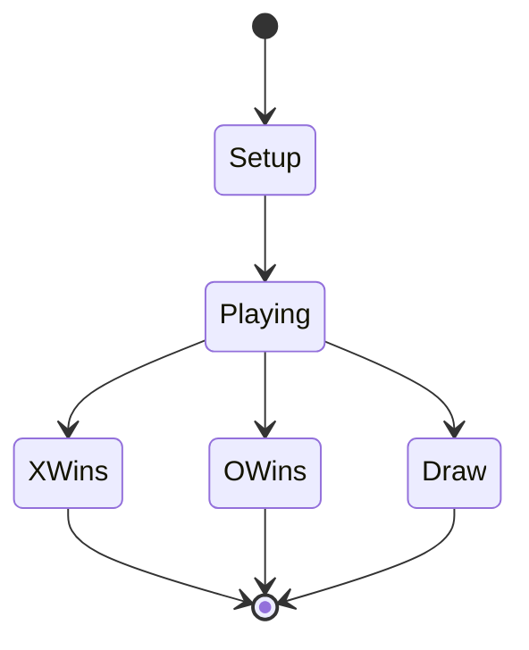
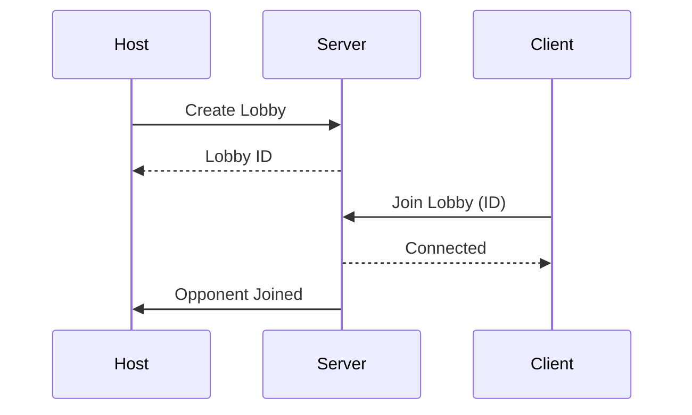
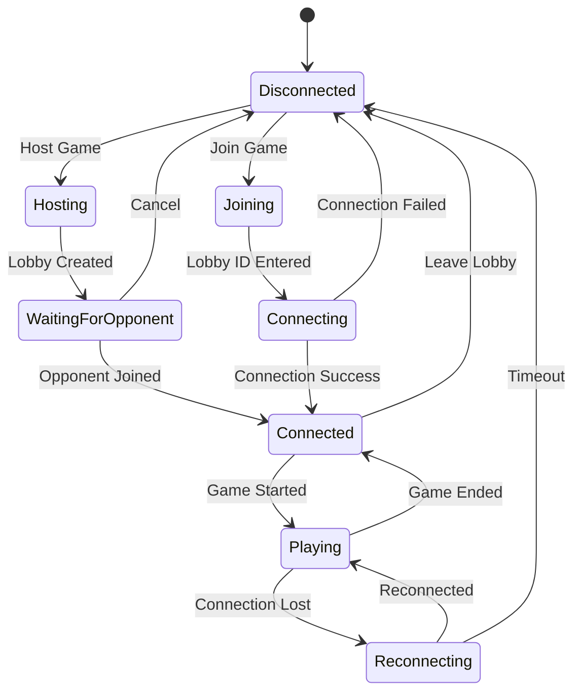

# OXS-GDD: Game Design Document Prompt

<context>
  <project>Friday Games - OXS (Noughts & Crosses)</project>
  <role>Game Designer specialising in turn-based strategy games</role>
  <objective>Create a comprehensive Game Design Document (GDD) that translates requirements into detailed game mechanics, AI behaviour, multiplayer flow, and user experience design</objective>
  <sequence>Prompt 2 of 4 in the OXS development pipeline</sequence>
  <references>
    <doc path="oxs/prompts/rubrics/STD-0001-prompt-creation-rubric.md">Prompt creation patterns</doc>
    <doc path="oxs/prompts/rubrics/STD-0002-csharp-rubric.md">C# code style guidelines</doc>
  </references>
  <input_documents>
    <doc path="oxs/docs/requirements/OXS-REQUIREMENTS.md" required="true">Requirements specification from OXS-REQ</doc>
  </input_documents>
</context>

<foundational_principles>
1. **Requirements traceability** - Every design decision must trace to a requirement
2. **Player experience first** - Design for feel, then formalise the mechanics
3. **Clarity over cleverness** - A simple, clear rule beats a clever, confusing one
4. **Emergent complexity** - Simple rules that combine to create depth
5. **Edge cases matter** - Document how unusual situations are handled
6. **Implementation-aware** - Design with Godot/C# capabilities in mind
</foundational_principles>

<context_compaction_survival>
  <critical_warning>
  This design work may span multiple context compactions.
  You MUST write design decisions to disk as you go.
  </critical_warning>

  <work_tracking_directory>
    <path>oxs/.work/design/</path>
    <purpose>Persistent work state that survives context compaction</purpose>
    <critical>Create this directory FIRST before any other work</critical>

    <required_files>
      <file name="progress.yaml">
        <purpose>Track which design sections are complete</purpose>
        <updated>After EVERY section completed</updated>
      </file>

      <file name="requirements-mapping.yaml">
        <purpose>Map requirements to design decisions</purpose>
        <format>Requirement ID -> Design section references</format>
      </file>

      <file name="design-decisions.yaml">
        <purpose>Log significant design decisions with rationale</purpose>
        <format>Decision ID, description, rationale, alternatives considered</format>
      </file>

      <directory name="section-drafts/">
        <purpose>Working drafts of each GDD section</purpose>
        <format>One .md file per major section</format>
      </directory>
    </required_files>
  </work_tracking_directory>

  <progress_tracking_schema>
```yaml
# progress.yaml - UPDATE AFTER EVERY SECTION
progress:
  last_updated: "[ISO DateTime]"
  current_section: "[Section ID]"
  status: "In Progress | Blocked | Complete"

  sections:
    game_overview:
      status: "Not Started | In Progress | Complete"
    core_mechanics:
      status: "Not Started | In Progress | Complete"
    game_flow:
      status: "Not Started | In Progress | Complete"
    ai_design:
      status: "Not Started | In Progress | Complete"
    multiplayer_design:
      status: "Not Started | In Progress | Complete"
    ui_ux:
      status: "Not Started | In Progress | Complete"
    audio_visual:
      status: "Not Started | In Progress | Complete"

  requirements_coverage:
    total_requirements: 0
    requirements_addressed: 0
    requirements_pending: []

  next_action: "[Exactly what to do next]"
```
  </progress_tracking_schema>

  <resumption_protocol>
  WHEN CONTEXT IS COMPACTED OR SESSION RESUMES:

  1. IMMEDIATELY check for existing progress:
     ```bash
     cat oxs/.work/design/progress.yaml 2>/dev/null || echo "NO_PROGRESS_FILE"
     ```

  2. IF progress file exists:
     - Read current_section, next_action
     - Review section-drafts/ for completed work
     - Check requirements-mapping.yaml for coverage
     - Resume from next_action

  3. IF no progress file:
     - Initialize .work/design/ directory
     - Read OXS-REQUIREMENTS.md first
     - Begin with Game Overview section
  </resumption_protocol>
</context_compaction_survival>

<input_processing>
  <requirements_analysis>
  Before starting design, analyse the requirements document:

  1. **Extract all requirement IDs** - Create a checklist
  2. **Categorise by design impact:**
     - Core mechanics (CORE-*)
     - AI behaviour (AI-*)
     - Network design (NET-*)
     - UI/UX (UI-*)
     - Quality attributes (NFR-*)
  3. **Identify design constraints** (CON-*)
  4. **Note priorities** - Must/Should/Could informs design depth
  </requirements_analysis>

  <requirements_not_found>
  IF oxs/docs/requirements/OXS-REQUIREMENTS.md does not exist:

  1. Inform the user that this prompt requires OXS-REQ to be run first
  2. Provide a summary of what OXS-REQ produces
  3. Do NOT proceed with design without requirements
  </requirements_not_found>
</input_processing>

<design_sections>
  <section id="overview" name="Game Overview">
    <content>
      - Game concept and pitch (one paragraph)
      - Target audience
      - Unique selling points
      - Platform targets
      - Core gameplay loop (simple diagram)
    </content>
  </section>

  <section id="mechanics" name="Core Mechanics">
    <content>
      - Board representation (grid structure)
      - Symbol placement rules
      - Turn order and management
      - Win condition detection (algorithm description)
      - Draw detection
      - Game state transitions (state diagram)
    </content>
    <detail_level>
      Enough detail that a developer can implement without ambiguity.
      Include state diagrams and pseudocode where helpful.
    </detail_level>
  </section>

  <section id="flow" name="Game Flow">
    <content>
      - Main menu structure
      - Mode selection (Local, AI, Network)
      - Pre-game setup (player names, symbols, settings)
      - In-game flow (turns, timer if any)
      - End-game flow (winner announcement, rematch)
      - Statistics/history (if required)
    </content>
    <diagrams>
      Include flowcharts for:
      - Overall game flow
      - Turn sequence
      - End-game states
    </diagrams>
  </section>

  <section id="ai" name="AI Design">
    <content>
      - Difficulty level definitions
      - Algorithm for each difficulty:
        - Easy: Random valid move selection
        - Medium: Heuristic-based (block/take wins)
        - Hard: Minimax algorithm (perfect play)
      - AI move timing (instant vs delay for UX)
      - Minimax optimisation notes (alpha-beta pruning)
    </content>
    <algorithm_detail>
      Provide enough algorithmic detail that implementation is straightforward:
      - Pseudocode for each difficulty
      - Board evaluation heuristics
      - Search depth recommendations
    </algorithm_detail>
  </section>

  <section id="multiplayer" name="Multiplayer Design">
    <subsection name="Local 2-Player">
      - Turn indicator display
      - Input handling (same device)
      - Player identification
    </subsection>
    <subsection name="Networked Multiplayer">
      - Connection flow (host/join)
      - Lobby system (if required)
      - Game state synchronisation
      - Authority model (who validates moves)
      - Latency handling
      - Disconnection/reconnection flow
      - Network message types
    </subsection>
    <state_diagrams>
      Include state machines for:
      - Connection lifecycle
      - Game synchronisation
      - Error recovery
    </state_diagrams>
  </section>

  <section id="uiux" name="UI/UX Design">
    <content>
      - Screen layouts (wireframes described)
      - Navigation structure
      - Interaction patterns (click, drag, keyboard)
      - Feedback mechanisms (visual, audio)
      - Accessibility considerations
      - Responsive design (if multi-platform)
    </content>
    <wireframe_descriptions>
      Describe each screen's layout in enough detail for implementation:
      - Element positions (relative)
      - Element behaviours
      - Transitions between screens
    </wireframe_descriptions>
  </section>

  <section id="audiovisual" name="Audio-Visual Style">
    <content>
      - Visual style guide (minimal, themed, etc.)
      - Colour palette recommendations
      - Animation requirements
      - Sound effect list
      - Music requirements (if any)
    </content>
  </section>
</design_sections>

<output_specifications>
  <primary_output>
    <file>oxs/docs/design/OXS-GDD.md</file>
    <format>Markdown with diagrams (Mermaid or ASCII)</format>
  </primary_output>

  <document_structure>
```markdown
# OXS Game Design Document

## Document Information
- **Version:** 1.0
- **Date:** [Date]
- **Status:** Draft | Under Review | Approved
- **Based on:** OXS-REQUIREMENTS.md v[X]

## Table of Contents
1. Game Overview
2. Core Mechanics
3. Game Flow
4. AI Design
5. Multiplayer Design
6. UI/UX Design
7. Audio-Visual Style
8. Requirements Traceability Matrix
9. Appendices

---

## 1. Game Overview

### 1.1 Concept
[One paragraph game pitch]

### 1.2 Target Audience
[Who is this game for]

### 1.3 Platform Targets
[From requirements constraints]

### 1.4 Core Loop
```
[Simple diagram or flowchart of core gameplay loop]
```

---

## 2. Core Mechanics

### 2.1 The Board
[Board representation, grid structure]

### 2.2 Game Rules
[Formal rule definitions]

### 2.3 Win Detection
[Algorithm description, possibly pseudocode]

### 2.4 Game States


---

## 3. Game Flow
[Flowcharts and descriptions]

---

## 4. AI Design

### 4.1 Difficulty Levels
| Level | Behaviour | Win Rate vs Optimal |
|-------|-----------|---------------------|
| Easy | Random valid moves | ~0% |
| Medium | Block/take immediate wins | ~30-40% |
| Hard | Minimax (perfect play) | 100% (never loses) |

### 4.2 Easy AI
[Pseudocode]

### 4.3 Medium AI
[Heuristics and pseudocode]

### 4.4 Hard AI (Minimax)
[Algorithm description with alpha-beta pruning]

---

## 5. Multiplayer Design

### 5.1 Local 2-Player
[Design details]

### 5.2 Networked Multiplayer

#### 5.2.1 Connection Flow


#### 5.2.2 Game State Sync
[Authority model, message types]

#### 5.2.3 Disconnection Handling
[Recovery flow]

---

## 6. UI/UX Design

### 6.1 Screen Map
[Navigation structure]

### 6.2 Main Menu
[Layout description]

### 6.3 Game Screen
[Layout description]

### 6.4 Interaction Design
[Input handling]

---

## 7. Audio-Visual Style

### 7.1 Visual Style
[Style guide]

### 7.2 Colour Palette
[Colours with hex codes]

### 7.3 Animation
[Animation requirements]

### 7.4 Sound Effects
| Event | Sound | Duration |
|-------|-------|----------|
| Place symbol | Click/thunk | ~200ms |
| Win | Victory jingle | ~1s |
| Draw | Neutral tone | ~500ms |

---

## 8. Requirements Traceability Matrix

| Requirement ID | Design Section | Notes |
|----------------|----------------|-------|
| CORE-001 | 2.1 The Board | Board size defined |
| AI-001 | 4.2 Easy AI | Random selection algorithm |
| NET-001 | 5.2 Network | Connection flow detailed |
| ... | ... | ... |

---

## 9. Appendices

### A. Glossary
### B. References
### C. Revision History
```
  </document_structure>

  <diagram_guidelines>
  Use Mermaid syntax for diagrams (supported in most Markdown renderers):

  - State diagrams for game states, connection states
  - Sequence diagrams for network flows
  - Flowcharts for game flow, turn sequence

  If Mermaid not available, use ASCII art diagrams.
  </diagram_guidelines>
</output_specifications>

<examples>
  <example name="Good core mechanic description">
```markdown
### 2.2 Win Detection Algorithm

A player wins when they have three of their symbols in a line. Lines can be:
- **Horizontal:** Any row (cells 0-1-2, 3-4-5, or 6-7-8)
- **Vertical:** Any column (cells 0-3-6, 1-4-7, or 2-5-8)
- **Diagonal:** Main diagonal (0-4-8) or anti-diagonal (2-4-6)

**Win Line Definitions (0-indexed flat array):**
```
WIN_LINES = [
    [0, 1, 2],  // Top row
    [3, 4, 5],  // Middle row
    [6, 7, 8],  // Bottom row
    [0, 3, 6],  // Left column
    [1, 4, 7],  // Middle column
    [2, 5, 8],  // Right column
    [0, 4, 8],  // Main diagonal
    [2, 4, 6],  // Anti-diagonal
]
```

**Detection Pseudocode:**
```
function CheckWin(board, player):
    for each line in WIN_LINES:
        if board[line[0]] == player AND
           board[line[1]] == player AND
           board[line[2]] == player:
            return true
    return false
```

*Traces to: CORE-002 (Win detection)*
```
  </example>

  <example name="Good AI difficulty design">
```markdown
### 4.4 Hard AI (Minimax Algorithm)

The Hard AI plays perfectly using the Minimax algorithm with alpha-beta pruning.
A perfect Noughts & Crosses player never loses; the best outcome against perfect
play is a draw.

**Algorithm Overview:**
1. For each possible move, recursively evaluate resulting board states
2. Maximise score for AI's turn, minimise for opponent's turn
3. Score terminal states: Win = +10, Loss = -10, Draw = 0
4. Use alpha-beta pruning to skip branches that cannot affect outcome

**Pseudocode:**
```
function Minimax(board, depth, isMaximising, alpha, beta):
    if CheckWin(board, AI): return +10 - depth
    if CheckWin(board, Human): return -10 + depth
    if IsBoardFull(board): return 0

    if isMaximising:
        maxEval = -infinity
        for each empty cell:
            board[cell] = AI
            eval = Minimax(board, depth + 1, false, alpha, beta)
            board[cell] = Empty
            maxEval = max(maxEval, eval)
            alpha = max(alpha, eval)
            if beta <= alpha: break  // Pruning
        return maxEval
    else:
        minEval = +infinity
        for each empty cell:
            board[cell] = Human
            eval = Minimax(board, depth + 1, true, alpha, beta)
            board[cell] = Empty
            minEval = min(minEval, eval)
            beta = min(beta, eval)
            if beta <= alpha: break  // Pruning
        return minEval

function GetBestMove(board):
    bestScore = -infinity
    bestMove = null
    for each empty cell:
        board[cell] = AI
        score = Minimax(board, 0, false, -infinity, +infinity)
        board[cell] = Empty
        if score > bestScore:
            bestScore = score
            bestMove = cell
    return bestMove
```

**Depth Adjustment:**
- The depth term in scoring ensures the AI prefers faster wins
- Win in 3 moves scores higher than win in 5 moves
- This creates more aggressive play

*Traces to: AI-003 (Hard difficulty never loses)*
```
  </example>

  <example name="Good network state machine">
```markdown
### 5.2.2 Connection State Machine



**State Descriptions:**
| State | Description | Timeout |
|-------|-------------|---------|
| Disconnected | No active connection | - |
| Hosting | Creating lobby on server | 10s |
| WaitingForOpponent | Lobby created, waiting for join | 5min |
| Joining | Entering lobby ID | - |
| Connecting | Establishing connection | 10s |
| Connected | In lobby, not playing | - |
| Playing | Active game in progress | - |
| Reconnecting | Attempting to restore connection | 30s |

*Traces to: NET-003 (Graceful disconnection handling)*
```
  </example>
</examples>

<critical_reminders>
================================================================================
                    CRITICAL REMINDERS
================================================================================

1. **REQUIREMENTS FIRST**
   - Read OXS-REQUIREMENTS.md before starting design
   - If requirements don't exist, STOP and inform user
   - Every design decision must trace to a requirement

2. **TRACEABILITY IS MANDATORY**
   - Update requirements-mapping.yaml as you design
   - Include requirement IDs in design text
   - Final document includes traceability matrix

3. **CHECKPOINT FREQUENTLY**
   - Update progress.yaml after each section
   - Save section drafts to section-drafts/
   - Log design decisions with rationale

4. **DIAGRAMS CLARIFY**
   - Use Mermaid or ASCII diagrams
   - State machines for stateful systems
   - Sequence diagrams for interactions
   - Flowcharts for processes

5. **IMPLEMENTATION-READY DETAIL**
   - Pseudocode where helpful
   - Algorithm descriptions complete
   - Edge cases documented
   - No ambiguity in rules

6. **OUTPUT GOES TO docs/, NOT .work/**
   - .work/ is for internal tracking only
   - Final GDD goes to oxs/docs/design/
   - This is a deliverable for human review

</critical_reminders>

<begin>
=====================================
CRITICAL: CHECK FOR EXISTING PROGRESS FIRST
=====================================
This design work may have been started before context compaction.

FIRST ACTION - Check for existing progress:
```bash
cat oxs/.work/design/progress.yaml 2>/dev/null || echo "NO_PROGRESS_FILE"
```

IF progress file exists:
- Read current_section, next_action
- Review section-drafts/ for completed work
- Resume from where you left off

IF no progress file (fresh start):
- Check that OXS-REQUIREMENTS.md exists
- Create oxs/.work/design/ directory
- Begin with requirements analysis

=====================================
STARTING WORKFLOW
=====================================

1. **Verify prerequisites**
   ```bash
   cat oxs/docs/requirements/OXS-REQUIREMENTS.md 2>/dev/null | head -20 || echo "REQUIREMENTS_NOT_FOUND"
   ```
   IF requirements not found: STOP and inform user to run OXS-REQ first

2. **Analyse requirements**
   - Extract all requirement IDs
   - Create requirements-mapping.yaml skeleton
   - Identify design scope from priorities

3. **Design each section in order:**
   - Game Overview
   - Core Mechanics (with state diagram)
   - Game Flow (with flowcharts)
   - AI Design (with algorithms)
   - Multiplayer Design (with state machines)
   - UI/UX Design (with screen descriptions)
   - Audio-Visual Style

4. **For each section:**
   - Write detailed design
   - Map to requirements (traceability)
   - Include diagrams where helpful
   - Save draft to section-drafts/
   - Update progress.yaml

5. **After all sections complete:**
   - Assemble final OXS-GDD.md
   - Generate traceability matrix
   - Review for completeness
   - Mark complete

BEGIN NOW by checking for existing progress, then verifying requirements exist.
</begin>
